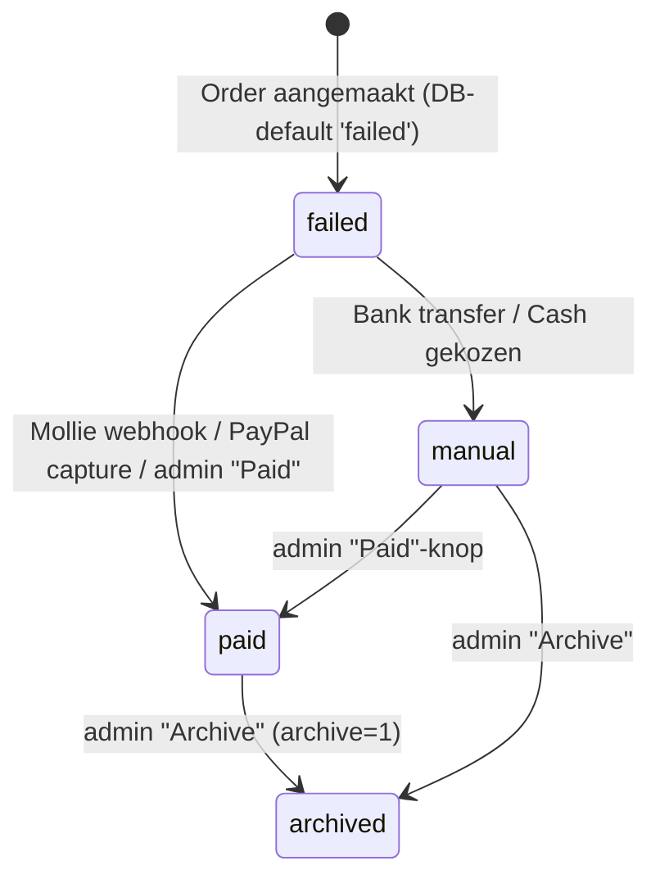

# 01 — Admin-inventarisatie Concept500 → Quartermaster

> Bron: `/Users/wout-intractief/Documents/Concept` (Laravel 12, Backpack for Laravel 6 + Pro + PermissionManager, RedSquirrel ImportOperation, Livewire 3, consoletvs/charts).
> Doel: volledige functionele inventaris van het admin-paneel als basis voor de migratie naar Next.js (App Router) + Prisma.
> Geen secrets/credentials overgenomen. Bestandsverwijzingen zijn relatief t.o.v. de Concept-repo.

---

## Inhoud

1. [Architectuur van het admin-paneel](#1-architectuur-van-het-admin-paneel)
2. [Navigatie / menustructuur](#2-navigatie--menustructuur)
3. [Rollen & permissies](#3-rollen--permissies)
4. [Modules (CRUD) — per entiteit](#4-modules-crud--per-entiteit)
5. [Custom (niet-CRUD) admin-pagina's & routes](#5-custom-niet-crud-admin-paginas--routes)
6. [Dashboard: widgets & metrics](#6-dashboard-widgets--metrics)
7. [Settings-systeem](#7-settings-systeem)
8. [Order-lifecycle, voorraad & mails](#8-order-lifecycle-voorraad--mails)
9. [Afbeeldingen (Cloudflare Images), jobs & commands](#9-afbeeldingen-cloudflare-images-jobs--commands)
10. [Validatieregels (custom Rules)](#10-validatieregels-custom-rules)
11. [Enums (domeinwaarden)](#11-enums-domeinwaarden)
12. [Git-historie: terugkerende thema's](#12-git-historie-terugkerende-themas)
13. [Pain points / tech debt](#13-pain-points--tech-debt)
14. [Aanbevelingen voor Quartermaster](#14-aanbevelingen-voor-quartermaster)
15. [Open vragen](#15-open-vragen)

---

## 1. Architectuur van het admin-paneel

| Aspect | Huidige situatie |
|---|---|
| URL-prefix | `/admin` (`config/backpack/base.php`) |
| Routes | `routes/backpack/custom.php` (CRUD + custom) **plus** een losse admin-groep in `routes/web.php` (paid/archive/bump/package-slip/pages-delete) |
| Auth guard | `guard => null` → Laravel default `web`. **Klanten en admins delen dezelfde `users`-tabel én guard** (CLAUDE.md zegt "aparte guard", config zegt anders) |
| Toegangscontrole | Middleware `App\Http\Middleware\CheckIfAdmin`: alleen rollen `owner` of `admin` mogen `/admin/*` in |
| Admin-registratie | `registration_open` default `true` → Backpack register-scherm (met Cloudflare Turnstile) maakt users met rol `user` aan |
| Login | Eigen `Admin\Auth\LoginController` (alleen extra `NoFourByteCharacters`-validatie) |
| Thema | `theme-coreuiv2` (+ eigen overrides in `resources/views/vendor/backpack/**`) |
| Settings in runtime | `LoadSettingsMiddleware` laadt **alle** `settings`-rijen in `config('settings.*')`, gecachet 60 min onder key `<shop_name>_settings` |
| Charts | `consoletvs/charts` via Backpack chart-widgets (Chart.js 2-stijl opties) |
| Livewire in admin | Dashboard-KPI-widgets (zie §6) |
| Feature-flag buiten settings | `config('features.state_field_enabled')` (env `STATE_FIELD_ENABLED`) |
| Multi-tenant model | **Eén installatie per shop** (subscription_type, Matomo id, emailer quota per DB). "Concept500" is een SaaS-product van Intractief; de militaria-shop is één tenant |

---

## 2. Navigatie / menustructuur

Bron: `resources/views/vendor/backpack/ui/inc/menu_items.blade.php`

| Menu-item | Route | Zichtbaar wanneer |
|---|---|---|
| Dashboard | `/admin/dashboard` | altijd |
| **Shop** › Products | `/admin/product` | altijd |
| Shop › Categories | `/admin/category` | altijd |
| Shop › Orders | `/admin/order` | altijd |
| Delivery › Regions | `/admin/region` | altijd |
| Delivery › Delivery Charges | `/admin/region-weight` | altijd |
| Delivery › Weights | `/admin/weight` | altijd |
| Content › Home | `/admin/home` | als minstens één content-toggle aan staat |
| Content › Terms / News / Links / Privacy / Events / Contact / Banners / About us | `/admin/term`, `/news`, `/link`, `/privacy`, `/events`, `/contact`, `/banner`, `/about` | per setting `terms`, `news`, `links`, `privacy`, `events`, `contact`, `banner`, `about` |
| Archive (producten) | `/admin/archive` | setting `toggle_archive_page` |
| Customers | `/admin/customer` | altijd |
| Tags | `/admin/tag` | setting `show_tags` |
| Stock Overview | `/admin/stock-overview` | altijd |
| **Admin** › Users / Roles / Settings / Menu items / Content pages | `/admin/user`, `/role`, `/setting`, `/menu-item`, `/custom-page` | **alleen rol `admin`** (menu-only, zie §3) |
| Payment Methods | `/admin/paymentmethod` | altijd |
| Product origins / Purchase records | `/admin/product-origin`, `/purchase-record` | setting `purchase_information` |
| Emailer | `/admin/emailer-mail` | setting `emailer` |
| Feedback | `/admin/feedback` | altijd |
| Confirmation message | `/admin/confirmation-message` | altijd |

Niet in menu maar wel bereikbaar: `/admin/content` (generieke Content CRUD, uitgecommentarieerd in menu), `/admin/archive-order`, `/admin/failed-order`, `/admin/email-subscriber` (via knoppen), `/admin/permission` (PermissionManager), `/admin/edit-account-info` (My Account).

---

## 3. Rollen & permissies

### 3.1 Rollen (spatie/laravel-permission via Backpack PermissionManager)

Geseed in `database/seeders/UserSeeder.php`: `user`, `owner`, `admin` (+ één seed-admin-account voor Intractief). **Er worden geen permissions gebruikt** — alle checks zijn `hasRole(...)`. `config/backpack/permissionmanager.php` staat create/update/delete van rollen én permissies toe.

| Rol | Betekenis (afgeleid) |
|---|---|
| `user` | Webshop-klant (frontend account, wishlist, adressen, orderhistorie). Geen admin-toegang |
| `owner` | Shop-eigenaar (klant van Intractief). Admin-toegang, beperkte settings |
| `admin` | Intractief-superuser/agency. Alles, incl. users/rollen/settings/menu/content pages |

### 3.2 Matrix (feitelijk afgedwongen vs. alleen UI)

Legenda: ✅ = toegestaan, ❌ = geblokkeerd in code, 👁 = alleen verborgen in menu (route wel bereikbaar), ⚙ = afhankelijk van setting.

| Functie | user | owner | admin | Waar afgedwongen |
|---|---|---|---|---|
| Admin-paneel in | ❌ | ✅ | ✅ | `CheckIfAdmin` |
| Products/Categories/Weights/Delivery charges create/update | ❌ | ✅ | ✅ | `CheckIfAdmin` + FormRequest `authorize()` (redundant) |
| Users & Roles CRUD | ❌ | 👁 (bereikbaar via URL!) | ✅ | alleen menu |
| Settings — lijst/bewerken | ❌ | ✅ alleen rijen met `role = OWNER`; 👁 menu verborgen | ✅ alle rijen | `SettingCrudController::restrictAccessForOwner` |
| Settings — create/delete | ❌ | ❌ | ✅ | `denyAccess` + `SettingsCreateRequest` |
| Menu items / Content pages | ❌ | 👁 (bereikbaar via URL) | ✅ | alleen menu |
| Archived orders | ❌ | ⚙ `toggle_order_archive_page` | ✅ altijd | `ArchiveOrderCrudController::setup` |
| Product import | ❌ | ⚙ `product_import` | ⚙ `product_import` | `denyAccess('import')` |
| Product create | ❌ | ⚙ abonnementslimiet | ⚙ abonnementslimiet | zie §4.1 |
| Overige modules | ❌ | ✅ | ✅ | `CheckIfAdmin` |

`OrderPolicy` bestaat maar is een lege stub; `AuthServiceProvider` registreert geen policies.

---

## 4. Modules (CRUD) — per entiteit

Algemene conventies in Backpack-setup:
- Vrijwel elke `setupShowOperation` verwijdert de delete-knop op de show-pagina (delete blijft in de lijst).
- `priority(n)` op kolommen = responsive verbergen op mobiel (#1294).
- `NoFourByteCharacters` (geen emoji/4-byte UTF-8) zit op bijna elk tekstveld (#1354) — wijst op een `utf8`(3-byte) database-charset.

### 4.1 Products (shop) — `ProductCrudController` extends `BaseProductCrudController`

| Aspect | Detail |
|---|---|
| Entiteit / tabel | `Product` / `products` (auto-increment start 50000) |
| Basisfilter | `active != ARCHIVED` |
| Operaties | List, Create, Update, Delete, Show, Fetch (ajax: category, tags, purchaseRecord), Dropzone (Pro), **Import** (RedSquirrel), **BulkActivate**, **BulkArchive**, **BulkCategorize**, **BulkStockControl** (custom ops in `Admin/Operations/*`) |
| Lijstkolommen | ID (zoekbaar), SKU ⚙`sku`, title (50), description (75), category (relation), price (locale-geformatteerd, sessie-valuta), quantity ("Qty."), active (enum) |
| Filters | Active (Active/Inactive), Quantity (Sold Out = 0), Category (select2) |
| Line-knoppen | **Bump to top** (GET `/admin/product/bump/{id}` → zet `updated_at = now()`; knop wordt 2× toegevoegd, setting `toggle_bump_to_top` effectief genegeerd), **Archive** ⚙`toggle_archive_page` (confirm → GET `/admin/products/archive/{id}` → `active = ARCHIVED`), Edit, Delete, Show |
| Top-knop | "Limit reached"-melding als abonnementslimiet bereikt (create wordt dan geweigerd) |
| Bulk-acties (bottom) | Activate (INACTIVE→ACTIVE), Archive (ACTIVE→ARCHIVED), Category (dropdown met alle categorieën incl. parent), Stock control (dropdown met StockControlTypeEnum) — alle via AJAX POST, check op `update`-access |
| Delete-logica | Geweigerd (422) als product in een `order_details` voorkomt. Bij delete: tags/related/wishlist detach, foto's async verwijderd uit Cloudflare (`DeleteProductPhotosJob`, afterCommit) |
| Show | SKU, title, description, category, price, purchase price, weight, quantity, stock control, notes, active, eerste foto als thumbnail, blur ⚙, tags, specifications |

**Formuliervelden (create/update)**

| Veld | Type | Conditie | Validatie (`CreateProductRequest` / `UpdateProductRequest`) |
|---|---|---|---|
| id | text readonly | alleen update | — |
| sku | number, uniek | ⚙ `sku`; default = max(sku, `default_sku`) + 1 | sometimes, required, numeric, min 1, max_digits 100 |
| title | text | | required, max 250, no 4-byte |
| slug | slug (verborgen, uit title) | | required, alpha_dash, max 250 (niet uniek meer) |
| description | easymde (Markdown) | | max 65535, no 4-byte |
| category | relationship, ajax, inline-create | | — (geen required!) |
| price_for_editing | number (prefix valuta) | | required, numeric, decimal 0-2, 0 … 21.474.836,47 |
| purchase_price_for_editing | number | ⚙ `show_purchase_price` | nullable, idem |
| weight | number (gram) | | required, integer ≥ 0 |
| quantity | number, default 1 | | required, integer ≥ 0 |
| stock_control | enum (RESERVED / SOLD / NOT_IN_SHOP / STOLEN⚙`toggle_stolen_status`) | | — |
| notes | textarea | | nullable, max 65535 |
| active | enum (INACTIVE/ACTIVE/ARCHIVED) | | — |
| photos | dropzone → Cloudflare Images (`CloudflareImagesUploader`) | maxFiles = `maximum_item_photos` óf bronze 3 / silver 5 / gold 20 | file, mimes jpeg/png/gif/jpg/svg/webp |
| blur | boolean | ⚙ `product_blur` | — |
| importance | number default 0 | ⚙ `toggle_product_importance` | nullable int (alleen create) |
| tags | relationship N:M, ajax, inline-create | ⚙ `show_tags` | — |
| specifications | table (key/value), default = setting `default_specs` | ⚙ `product_specifications` | — |
| relatedProducts | select2_multiple (N:M `related_products`) | ⚙ `related_products` | — |
| purchaseRecord | relationship, inline-create | ⚙ `purchase_information` | — |

**Bijzondere businesslogica (model `Product`)**
- Prijzen opgeslagen als integer minor units (`brick/money`, `MoneyCasts`); invoer via `*_for_editing` accessors, conversie in `saving`-hook leest **direct uit `request()`**.
- Herbevoorrading: als quantity van 0 → >0 gaat, wordt `sold_on` gereset (#1271).
- `updating`-hook: als product al ACTIVE was, worden timestamps **niet** bijgewerkt (#1341 — "last updated"-sortering verandert niet bij gewone edits; alleen "Bump to top" zet `updated_at`).
- Abonnementslimiet (in `ProductCrudController::setup`): telt producten met `active = ACTIVE` én `quantity > 0`; limiet = `maximum_items` óf bronze 100 / silver 500 / gold onbeperkt. Bij overschrijding: create geweigerd + melding met mailto naar Concept500.
- Productstatus (frontend, `ProductStatusService`): ARCHIVED > SOLD (qty 0 + SOLD) > STOLEN (qty 0 + STOLEN) > RESERVED (qty 0 + RESERVED, of recent gereserveerd binnen `reserved_time` seconden via `product_reserved_on` bij qty ≤ 1) > ACTIVE. `NOT_IN_SHOP` = niet tonen in shop.
- Kolommen in model maar niet in formulier: `age_restricted`, `sale_item` (uitgecommentarieerd), `product_id` (legacy, start 5000), `photo_count` (legacy migratie), `sold_on`, `product_reserved_on`.

### 4.2 Archive (gearchiveerde producten) — `ArchiveCrudController`

| Aspect | Detail |
|---|---|
| Entiteit | `Product` met `active = ARCHIVED` |
| Operaties | Erft Base: List, Update, Delete, Show, Fetch + Dropzone. **Create geweigerd** |
| Kolommen/filters/form | Identiek aan Products (incl. Bump-knop). Geen bulk-acties, geen import |
| Terugzetten | Alleen door `active` handmatig op ACTIVE/INACTIVE te zetten in edit-formulier |
| Frontend | Publieke `/archive`-pagina (ArchiveController) toont gearchiveerde producten |

### 4.3 Categories — `CategoryCrudController`

| Aspect | Detail |
|---|---|
| Entiteit | `Category` (zelf-relatie `parent_id`, **max. 2 niveaus**: parent-keuze beperkt tot root-categorieën) |
| Operaties | List, Create, Update, Delete, Show, InlineCreate (vanuit product-form) |
| Kolommen | title, parent, active; default sort title asc |
| Filters | Parent (select2, root-categorieën) |
| Velden | title (required, max 35, no 4-byte), slug (verborgen; required, alpha_dash, max 100, uniek), parent (relationship, root-only, niet zichzelf), active (checkbox) |
| Logica | `saved`/`deleting` → **`Cache::flush()`** (volledige cache incl. settings). Geen bescherming tegen verwijderen met producten (FK-gedrag onbekend) |

### 4.4 Tags — `TagCrudController`

| Aspect | Detail |
|---|---|
| Operaties | List, Create, Update, Delete, Show, InlineCreate |
| Kolommen | name (50), description (50) |
| Velden | name (required, max 250, **alpha_dash**), description (easymde, max 65535) |
| Logica | Delete geweigerd (422) als tag aan producten hangt. Save/delete → `Cache::flush()` |

### 4.5 Orders — `OrderCrudController` / `ArchiveOrderCrudController` / `FailedOrderCrudController` (gedeelde `BaseOrderCrudController`)

| View | Basisfilter | Extra |
|---|---|---|
| Orders | `archive = 0` en `payment_status != failed` | Line-knop **Archive** (GET `/admin/orders/archive/{id}` → `archive = 1`), top-knoppen "Archived Orders" ⚙`toggle_order_archive_page` en "Failed Orders" |
| Archived orders | `archive = 1` en `payment_status != failed` | Voor owner alleen als ⚙`toggle_order_archive_page`; admin altijd |
| Failed orders | `payment_status = failed` (zowel archived als niet) | Geen "Failed Orders"-knop |

| Aspect | Detail |
|---|---|
| Operaties | List, Show, **Delete (hard delete, zichtbaar in lijst)**. Create/Update geweigerd (formuliervelden zijn wel gedefinieerd maar dood) |
| Lijstkolommen | Order Number (id), Date, name, address, email, notes, delivery, total, age_verify (bedoeld ⚙, maar bug: leest `config('age_verify')` → nooit getoond), payment_method, payment_status |
| Filters | Geen |
| Line-knoppen | **Paid** (alleen als status ≠ paid en `order_paid_on` leeg → GET `/admin/order/paid/{id}` → `payment_status = paid`, `order_paid_on = now()`), **Packing Slip** (PDF), Archive (alleen Orders-view) |
| Show | id, customer (user), name, address (100), zip, city, state, country, region, delivery_address, phone, email, notes (volledige tekst, custom kolom-view), delivery, total, age_verify, payment_method, payment_status, payment_id, payment_message, archive, created/updated, **products** (subtabel: id, quantity, price, sku⚙) + Packing Slip-knop |
| Packing slip | `spatie/laravel-pdf`, view `pdf/package-slip.blade.php`: ordernr, datum, klantgegevens (incl. email/telefoon #1361), shopgegevens (shop_name, email, domein), regels (id, titel, aantal; prijzen ⚙`toggle_packing_slip_prices`), totaal aantal items, notes, subtotal/shipping/total + betaalmethode |
| Factuur | **Er is geen factuur-functionaliteit** — alleen packing slip |
| Statussen | `payment_status`: `failed` (DB-default sinds #1358), `paid`, `manual` (bankoverschrijving/contant), legacy `pending` (gemigreerd naar failed). Daarnaast `archive` (bool) en `order_paid_on` (datum). Geen verzend-/fulfilmentstatus |

### 4.6 Customers — `CustomerCrudController`

| Aspect | Detail |
|---|---|
| Entiteit | `Customer` = **virtueel model** op `orders`, global scope groepeert op `orders.email` (left join `users` op email) |
| Operaties | List, Show (create/update/delete geweigerd) |
| Kolommen | name, email, Registered/Guest-badge, order_count, total_spent (Money), last_order_date (default sort desc) |
| Show | name, email, phone, registered user (#id), total orders, total spent, tabel met alle orders (link naar order-show) |
| Opmerking | Telt **ook failed orders** mee in count/total_spent. Geen aparte klantentabel; geregistreerde frontend-users zitten in `users` |

### 4.7 Stock Overview — `StockOverviewCrudController`

| Aspect | Detail |
|---|---|
| Entiteit | `Product` met `quantity != 0` (ook archived/inactive!) |
| Operaties | List (+ **export-knoppen**: Backpack Pro export CSV/Excel/PDF/print). Alle line-knoppen verwijderd; Create/Update/Delete traits aanwezig maar leeg |
| Kolommen | id, title, quantity, price, totalPrice (price × qty) |
| Widgets | Total items (count van **alle** producten), Total quantity, Total sell price (som price×qty, NL-format) — berekend in PHP over `Product::all()` |

### 4.8 Delivery: Regions / Weights / Delivery charges

**Regions — `RegionCrudController`**

| Aspect | Detail |
|---|---|
| Operaties | List, Create, Update, Delete, Show, InlineCreate, Fetch (weights) |
| Kolommen | title |
| Velden | title (required, max 250, uniek), `weights` = N:M relationship naar Weight met pivot-subveld `delivery_charge` (number; regex max 6 cijfers + 2 decimalen) |
| Show | title + tabel weights met delivery_charge |

**Weights — `WeightCrudController`**: alleen `weight` (gram; required, uniek, 1…2^31-1). InlineCreate. Seed: 1, 50, 100, 250, 500, 1000 … 30000 g.

**Delivery charges — `RegionWeightCrudController`** (pivot `region_weights` als eigen CRUD)

| Aspect | Detail |
|---|---|
| Kolommen | region_id (zoekbaar op regionaam), weight_id, delivery_charge |
| Filters | Region (select2) |
| Knoppen | Standaard "Create" vervangen door "Add delivery costs" → `/admin/region/create` |
| Velden | region (ajax, inline-create), weight (ajax, inline-create), delivery_charge (number) |
| Validatie | region/weight required; combinatie region+weight uniek; charge regex 6.2 |
| Logica | Verzendkosten = lookup op (regio, gewichtsklasse); klant kiest regio in checkout |

### 4.9 Payment Methods — `PaymentmethodCrudController`

| Aspect | Detail |
|---|---|
| Operaties | List, Update, Show (create & delete geweigerd) |
| Kolommen | name, active (bool), surcharge (alleen als ergens surcharge > 0) |
| Velden | name (readonly bij update), visible ("Show surcharge"-checkbox, toggelt surcharge-veld via `js/paymentMethods.js`), surcharge (% 0–100), active |
| Data | Mollie, Paypal, Bank transfer, Cash |
| Logica | **Naam is gekoppeld aan strategy**: `strtoupper(str_replace(' ', '_', name))` → `MOLLIE`, `PAYPAL`, `BANK_TRANSFER`, `CASH` in `PaymentStrategyFactory`. Surcharge wordt in checkout op totaal toegepast (RoundingMode UP) |

### 4.10 Product origins & Purchase records (⚙ `purchase_information`)

| Module | Velden | Validatie | Opmerking |
|---|---|---|---|
| ProductOrigin | `setFromDb()` → `name` | **geen** (lege request) | InlineCreate, Fetch |
| PurchaseRecord | product_origin (ajax, inline-create), invoice_number | **geen** | Kolommen invoice_number, product_origin. Product heeft `purchase_record_id` (N:1) |

Doel: inkoopadministratie (waar komt een stuk vandaan + inkoopfactuurnummer). Model-relaties zijn half-af (`ProductOrigin::purchaseRecords` is BelongsToMany i.p.v. HasMany; `PurchaseRecord::product` BelongsTo i.p.v. HasMany).

### 4.11 Users — `UserCrudController` (extends PermissionManager UserCrudController)

| Aspect | Detail |
|---|---|
| Operaties | List, Create, Update, Delete, Show (+ PermissionManager rol-/permissie-checklists) |
| Velden | name, email, password + confirmation (alleen create; bij update verwijderd), birth_date (date), roles/permissions (uit package) |
| Validatie (`UserRequest`) | name required max 250; email required/uniek/max 255; password required min 6 confirmed (create); birth_date required, na 1900-01-01, voor vandaag |
| Logica | `birth_date` → `is_adult` (leeftijdsverificatie). **FK `orders.customer_id` heeft `onDelete cascade` → user verwijderen verwijdert diens orders** (te verifiëren in productie-DB) |

Roles / Permissions: standaard PermissionManager CRUD's (`/admin/role`, `/admin/permission`).

### 4.12 Settings — `SettingCrudController`

Zie §7 voor het datamodel en alle keys.

| Aspect | Detail |
|---|---|
| Operaties | List, Create, Update, Delete, Show, Dropzone |
| Kolommen | key, value (voor ENUM het label uit `list`), created_at, updated_at |
| Create-velden | title, description, key, setting_type (enum), string_value, int_value, boolean_value, list (table) — zichtbaarheid via `js/settings.js` (alleen string/boolean/int/list) + role (OWNER/ADMIN) |
| Update-velden | title, description, key (readonly) + **één waardeveld afhankelijk van type**: STRING→text, INT→number, BOOLEAN→checkbox, ENUM→select uit `list`, LIST→table, IMAGE (of key bevat `_image`)→dropzone Cloudflare; key bevat `_color`→color picker; key bevat `_font`→`select_font` (Google Fonts API) + role |
| Validatie (create) | title required max 250; key required uniek; setting_type required; string_value required_if string … |
| Logica | Owner ziet alleen `role = OWNER` rijen; bij openen formulier → `CacheService::clearShopSettings()` |

### 4.13 Content (legacy CMS) — 9 controllers op één `contents`-tabel

Alle op model `Content`, gefilterd op `page` (`ShopPageEnum`). Allemaal: List, Create, Update, Delete, Show, **Reorder** (nested set `parent_id/lft/rgt/depth`, max_level 6). Validatie `ContentRequest` (title required max 250; content max 65535; no 4-byte; start/end date; contact-table regel).

| Route | page | Lijstkolommen | Formuliervelden |
|---|---|---|---|
| `/admin/home` | HOME | title, content | title*, content* (easymde) |
| `/admin/term` | TERMS | title, content | title*, content* |
| `/admin/privacy` | PRIVACY | title, content | title*, content* |
| `/admin/about` | ABOUT | title, content | title*, content* |
| `/admin/news` | NEWS | title, content | title*, content* |
| `/admin/link` | LINKS | title, content, url | title*, url*, content* |
| `/admin/events` | EVENTS | title, content, start_date, end_date | title*, content*, start_date*, end_date (≥ start) |
| `/admin/contact` | CONTACT | title, content | title, contact (table name/desc, 0–15 rijen; name ≤150, desc ≤4000) |
| `/admin/banner` | BANNER | title, content, active | title*, content*, active |
| `/admin/content` (generiek, niet in menu) | alle | page, title | page (enum), title*, content* — reorder max_level 2 |

`ContentObserver` is geregistreerd maar volledig leeg.

### 4.14 Content pages (block-based CMS) — `ContentPageCrudController`

| Aspect | Detail |
|---|---|
| Entiteit | `ContentPage` (url, title, slug) 1:N `ContentBlock` (gesorteerd op `order`) |
| Operaties | List, Create, Update, Delete, Show, Dropzone. **Delete geblokkeerd voor `url = home`**; home heeft readonly url/title/slug |
| Kolommen | URL, title, slug |
| Velden | url (prefix `/pages`, geen spaties, max 2 slashes, uniek), title, slug (uniek), **blocks** (repeatable, herordenbaar via `order`) |
| Publieke URL | `/pages/{parent}/{child?}/{grandchild?}`; homepage = page `home` |

**Block-subvelden** (`type` bepaalt welke zichtbaar zijn, `public/js/contentBlocks.js`):

| Block-type | Zichtbare velden | Extra validatie |
|---|---|---|
| TEXT | title, content, link_text, button_link | link_text ⇔ button_link (url) |
| TEXT_HORIZONTAL | title, content | |
| TEXT_IMAGE | title, content, image, media_type | |
| QUOTE | title | |
| CTA | title, content, link_text, button_link, media_type (image/bg-color) | content max 50 |
| TESTIMONIAL | title, content, link_text, site_link, author | content, author, site_link (url), link_text (≤50) required |
| NEW_ITEMS | title, link_text, button_link, amount | amount 1–6 |
| GALLERY | title, image (multi) | |
| CATEGORIES | title | |
| HERO | title, link_text, button_link, media_type | alleen als eerste block toegestaan |
| TEXT_PRODUCT | title, content, product_id (select uit producten) | |
| TEXT_CAROUSEL | title, content, media_type, image | |
| EMAILER | title, content, link_text | alleen selecteerbaar als ⚙ `emailer` |

Algemeen: title ≤100; background_color (color, bij media_type BACKGROUND_COLOR); image = Cloudflare dropzone; `button_link` = select2 met route-opties (`RouteService::getRouteOptions`) of vrije URL.

### 4.15 Menu items — `MenuItemCrudController`

| Aspect | Detail |
|---|---|
| Operaties | List, Create, Update, Delete, **Reorder** (max_level 1). Show geweigerd |
| Lijst | alleen root-items (`parent_id null`): main_name, location |
| Filters | Location (Header/Footer) |
| Velden | location (HEADER/FOOTER), main_name ("Column name" bij footer), url (select2 routes/vrij; alleen header), children = repeatable (sub_name, sub_url) herordenbaar |
| Validatie | location required + `MaxMenuItems` (max **7** header-items, max **4** footer-kolommen); header: main_name required, url required/url |
| Logica | Model-`saving`-hook met vreemde logica (verwijdert item als `parent_id` null) — zie pain points |

### 4.16 Emailer (nieuwsbrief) — `EmailerMailCrudController` + `EmailSubscriberCrudController` (⚙ `emailer`)

**Emailer mails**

| Aspect | Detail |
|---|---|
| Operaties | List, Create, Update, Delete (alleen zolang `sent_at` null), Show |
| Kolommen | subject, content, sent_at, sent_count |
| Widgets | Active subscribers (progress t.o.v. 1000), Remaining email credits = `emailer_quota` (progress t.o.v. 10000) |
| Velden | subject (required, max 255), content (textarea; required, max 65535) — content wordt als Markdown-mail gerenderd |
| Knoppen | **Send Email** (confirm → GET `/admin/emailer-mail/{id}/send`), "Email Subscribers" (top) |
| Send-logica | Quota-check: weigeren als `emailer_quota` ≠ -1 en (≤0 of < aantal actieve subscribers). Dispatch `SendEmailerMail` per chunk van 200 subscriber-ids; `sent_at` direct gezet. Job queue't per subscriber `NewsletterMail` via mailer `newsletter` (met List-Unsubscribe header #1329), verhoogt `sent_count`, verlaagt `emailer_quota` en wist settings-cache. `-1` = onbeperkt |

**Email subscribers**

| Aspect | Detail |
|---|---|
| Basisfilter | `verification_status = active` |
| Operaties | List, Delete, **BulkDelete**, Show (create/update geweigerd) |
| Kolommen | Name (via user met zelfde email), email, subscribed at |
| Widget | Active subscribers |
| Lifecycle | Double opt-in: frontend inschrijving → `pending` + verificatiemail (event `EmailerSubscribed`) → `/emailer/activate/...` → `active`; uitschrijven via `/emailer/unsubscribe/...` → `unsubscribed` |

---

## 5. Custom (niet-CRUD) admin-pagina's & routes

| Route | Methode | Controller | Functie |
|---|---|---|---|
| `/admin/feedback` | GET/POST | `FeedbackController` | Feedbackformulier (subject ≥3, content ≥10, Turnstile) → `Mail::raw` naar **hardcoded extern adres** (Coloss/Intractief) |
| `/admin/confirmation-message` (+ `/get`, `/save`) | GET/POST | `CustomOrderMessageController` | Quill-editor (CDN) voor custom tekst in orderbevestigingsmails; opgeslagen als **bestand** `storage/app/custom_email.html` (niet in DB). Gebruikt in `OrderConfirmation` en `OrderConfirmationOwner` |
| `/admin/order/paid/{id}` | **GET** | `OrderCrudController@paid` | Markeer betaald |
| `/admin/orders/archive/{id}` | **GET** | `@archive` | Archiveer order |
| `/admin/orders/package-slip/{id}` | GET | `@packageSlip` | PDF packing slip |
| `/admin/product/bump/{id}` | **GET** | `ProductCrudController@bump` | Bump to top (+ redirect-fix na sessie-verloop #1363) |
| `/admin/products/archive/{id}` | **GET** | `ProductCrudController@archive` | Archiveer product |
| `/admin/emailer-mail/{id}/send` | **GET** | `EmailerMailController@send` | Verstuur nieuwsbrief |
| `/admin/pages/{id}` | GET | `ContentPageCrudController@delete` | **Dode route** (methode bestaat niet) |
| `/admin/charts/*` | GET | Chart-controllers | JSON voor dashboardcharts (turnover, monthly-users, monthly-returning-visitors, weekly-top-visited-products, most-wishlisted-products) |
| `/admin/edit-account-info` | GET/POST | Backpack | My Account (eigen view-override, wachtwoord wijzigen zonder huidig wachtwoord #1337) |
| `/admin/login`, `/register`, `/password/*` | | Backpack (+ eigen Login/Register) | Auth |

---

## 6. Dashboard: widgets & metrics

Bron: `resources/views/vendor/backpack/ui/dashboard.blade.php`. Alle bedragen in minor units; "turnover" = `SUM(total) − SUM(delivery)`, **exclusief alleen `failed`** (dus incl. `manual`/onbetaalde bankoverschrijvingen).

| # | Widget | Type | Metric | Bron |
|---|---|---|---|---|
| 1 | Average Order Value | Livewire `AverageOrderValue` | (turnover laatste 30 d) / (#orders laatste 30 d) + % verschil t.o.v. dag 31–60 | DB orders |
| 2 | Amount of orders | Livewire `AmountOfOrdersInAPeriod` | #orders laatste 30 d (≠ failed) + % verschil | DB |
| 3 | Total turnover | Livewire `TotalTurnover` | turnover laatste 30 d + % verschil | DB (`OrderService::getOrderValueWithoutDeliveryForPeriod`) |
| 4 | Turnover (chart) | `TurnoverChartController` (line) | turnover per dag, 30 dagen (60 queries) | DB |
| 5 | Visits in real-time | Livewire `MatomoRealTimeVisits` (lazy) | visits & actions laatste 30 min en 24 u (`Live.getCounters`) | Matomo API (hardcoded host) |
| 6 | Visitors (chart) ⚙ | `MonthlyUsersChartController` | unieke bezoekers + totaal visits per dag, 30 d (`VisitsSummary.get`) | Matomo |
| 7 | Returning visitors (chart) ⚙ | `MonthlyReturningVisitorsChartController` | returning vs new unieke bezoekers per dag, 30 d (`VisitFrequency.get`) | Matomo |
| 8 | Most visited products ⚙ | `WeeklyTopVisitedProductsChartController` (bar) | top 5 product-URL's laatste 7 d: visits & hits (label "Product Id: x") | Matomo `Actions.getPageUrls` |
| 9 | Most wishlisted products ⚙ | `MostWishlistedProductsChartController` (bar) | top 10 producten op #unieke users in `wishlist` | DB |

⚙ = rijen 6–9 alleen als Matomo-token (services) én setting `matomo_id` gevuld zijn (de wishlist-chart zit onterecht in die conditie). Widget 5 wordt altijd getoond.

Overige "widgets" in modules: StockOverview (3 tellers), Emailer (subscribers + credits), Email subscribers (teller). `Livewire\Counter` is een ongebruikte demo-component.

---

## 7. Settings-systeem

### 7.1 Datamodel

Tabel `settings`: `id, key (uniek), value (legacy), role (OWNER|ADMIN), title, description, setting_type, string_value, boolean_value, int_value, list_value, image_value, list (json), timestamps`. Alle `*_value`-kolommen zijn `string`.

`SettingTypeEnum`: `string`, `boolean`, `int`, `enum` (waarde in `list_value`, opties in `list`), `image` (Cloudflare-id's in `image_value`), `list` (array in `list`).
`Setting::getValueAttribute()` kiest het juiste veld op basis van type. Bronnen van rijen: `SettingSeeder`, `NewSettingSeeder` (firstOrCreate/updateOrCreate) en ~15 data-migraties.

Speciale UI-afleiding op basis van **key-naam**: `*_image` → dropzone, `*_color` → color picker, `*_font` → Google-Fonts select.

### 7.2 Alle keys per categorie

Rol = wie het mag bewerken (OWNER-rijen zijn zichtbaar voor owner én admin; ADMIN-rijen alleen voor admin).

**Algemeen / identiteit**

| Key | Type | Rol | Default | Gebruik |
|---|---|---|---|---|
| shop_name | string | OWNER | – | Overal (titel, mails, packing slip) **én cache-key prefix** |
| email | string | OWNER | – | Ontvanger owner-orderbevestiging, packing slip, reply-to |
| currency | enum (EUR, USD, GBP, AUD, JPY, CAD, CNY, NZD) | OWNER | EUR | Basisvaluta prijzen/Money |
| timezone | enum (alle PHP-tz) | ADMIN | UTC | Zet app-timezone runtime (#1348) |
| matomo_id | string | ADMIN | – | Matomo site-id voor dashboard |
| confirmation_message | string | OWNER | – | **Lijkt ongebruikt** (vervangen door file-based confirmation message) |

**Abonnement & limieten (SaaS)**

| Key | Type | Rol | Default | Gebruik |
|---|---|---|---|---|
| subscription_type | enum bronze/silver/gold | ADMIN | bronze | Product- en fotolimieten |
| maximum_items | int | ADMIN | – | Override max actieve producten |
| maximum_item_photos | int | ADMIN | – | Override max foto's per product |
| product_import | boolean | OWNER | – | Import-operatie aan/uit |
| emailer | boolean | ADMIN | false | Emailer-module aan/uit (+ EMAILER-block) |
| emailer_quota | int | **OWNER** | 1000 | Resterende mailcredits; −1 = onbeperkt; job verlaagt |

**Content-pagina's & navigatie**

| Key | Type | Rol | Gebruik |
|---|---|---|---|
| terms, privacy, contact | boolean | ADMIN | Content-pagina + admin-menu aan/uit |
| links, about, events, news, banner | boolean | OWNER | idem |
| home_shop | boolean | OWNER | Home → homepage of direct naar shop |
| toggle_banner_homepage / toggle_banner_pages | boolean | OWNER | Banner op home / overige pagina's |
| toggle_contact_form | boolean | OWNER | Contactformulier aan/uit |

**Shop-weergave (frontend)**

| Key | Type | Rol | Default | Gebruik |
|---|---|---|---|---|
| list_or_grid_view | enum list-view/grid-view | OWNER | grid-view | Shop-layout |
| shop_display_amount | enum 3/4 | OWNER | 4 | Producten per rij |
| shop_selected_filter | enum featured/highlow/lowhigh/newest/oldest/lastupdated | OWNER | newest | Default sortering |
| endless_scrolling | boolean | OWNER | 0 | Infinite scroll i.p.v. paginering |
| show_price_when_sold | boolean | OWNER | 0 | Prijs tonen bij uitverkocht |
| toggle_price_range | boolean | OWNER | false | Prijsfilter-slider |
| show_tags | boolean | OWNER | true | Tags in shop + Tags-module/veld |
| toggle_listview_stock_code / toggle_gridview_stock_code | boolean | OWNER | false | Productcode tonen (seed zet per abuis `string_value`) |
| direct_checkout | boolean | OWNER | 0 | Na "in mandje" direct naar checkout |
| show_emailer_popup | boolean | OWNER | true | Nieuwsbrief-popup |
| age_verify | boolean | OWNER | 0 | Leeftijdsverificatie-popup (militaria!) |
| share_on_socials | boolean | OWNER | 0 | **Dood**: layout leest `settings.socials-share` |

**Productbeheer**

| Key | Type | Rol | Gebruik |
|---|---|---|---|
| sku | boolean | OWNER | SKU-veld/kolom aan |
| default_sku | int | OWNER | Startwaarde automatische SKU |
| product_blur | boolean | OWNER | Blur-optie per product (gasten zien blur-variant) |
| product_specifications | boolean | OWNER | Specificatietabel aan |
| default_specs | list | OWNER | Default spec-namen bij nieuw product |
| related_products | boolean | OWNER | Gerelateerde producten-veld |
| purchase_information | boolean | OWNER | Inkoopadministratie (origins/records) |
| show_purchase_price | boolean | OWNER | Inkoopprijs-veld |
| toggle_product_importance | boolean | OWNER | Importance-veld ("featured"-sortering) |
| toggle_bump_to_top | boolean | OWNER | Bump-knop (effectief genegeerd) |
| toggle_stolen_status | boolean | OWNER | STOLEN als stock-control-optie |
| toggle_archive_page | boolean | OWNER | Product-archief (admin + publieke archive-pagina) |
| reserved_time | enum 10 s … 1 u | ADMIN | Hoe lang product "reserved" is na in-mandje (#1336) |

**Orders**

| Key | Type | Rol | Gebruik |
|---|---|---|---|
| toggle_order_archive_page | boolean | OWNER | Archived-orders voor owner |
| toggle_packing_slip_prices | boolean | OWNER | Prijzen op packing slip |

**Theming**

| Key | Type | Rol | Gebruik |
|---|---|---|---|
| logo, banner_image, cta_image | image | OWNER | Cloudflare-afbeeldingen |
| primary_color, secondary_color, tertiary_color | string (color picker) | OWNER | CSS vars `--cmd-*` |
| text_font, heading_font | enum (Google Fonts) | OWNER | Fonts |

Externe config die niet in settings zit (env/services): Matomo token, Cloudflare Images account/hash/API-token, Mollie/PayPal credentials, Google Fonts API key, Turnstile keys, mail-mailers (`newsletter`).

---

## 8. Order-lifecycle, voorraad & mails

| Stap | Waar | Effect |
|---|---|---|
| Checkout bevestigen | `OrderService::processOrder` | In transactie met `lockForUpdate` stock-check; order + order_details aangemaakt (regelprijs = prijs × aantal). **Stock wordt hier niet verlaagd** |
| Betaling starten | `PaymentStrategyFactory` | Mollie (redirect + webhook in productie), PayPal (redirect, capture bij return), Cash/Bank transfer → `payment_status = manual` |
| Mollie webhook | `MolliePaymentStrategy::handle` | paid → `payment_status = paid`, `payment_id`. Niet-paid-tak is buggy (roept `update` aan op order-id) |
| Klant landt op `/order/{uuid}` | `OrderController::status` | Als status `paid` of `manual` en `order_paid_on` leeg: event **`OrderPlaced`** (eenmalig via `is_order_placed_event_fired`), `order_paid_on = now()` (niet bij manual) |
| `OrderPlaced` listeners | `UpdateStock`, `SendOrderPaidMails`, `ForgetBasketSession` | Stock −aantal, `sold_on` bij 0; mail `OrderConfirmation` naar klant + `OrderConfirmationOwner` naar setting `email` (beide met custom message uit bestand, reply-to #1360); `email_sent_on` |
| Admin "Paid" | `setOrderPaidOn` | `paid` + `order_paid_on`. **Vuurt geen event/mails** |
| Admin "Archive" | `archive` | `archive = 1` |
| Admin "Delete" | Backpack | Hard delete, **geen stock-restore** |

Belangrijk: **voorraadverlaging en bevestigingsmails hangen af van het bezoek aan de statuspagina** — als een klant na betalen de browser sluit, krijgt de webhook de order wel op `paid`, maar worden stock en mails niet verwerkt.

Andere mails: `EmailerVerificationMail` (double opt-in), `NewsletterMail`, contactformulier (`emails/contact`), password reset. `emails/orders/shipped.blade.php` bestaat maar wordt niet gebruikt (geen verzendstatus).

---

## 9. Afbeeldingen (Cloudflare Images), jobs & commands

### 9.1 Upload-flow (admin)

- Backpack Pro Dropzone → tijdelijke map → `App\Adapters\CloudflareImagesUploader::uploadFiles` uploadt **synchroon** naar Cloudflare Images (via `foodticket/cloudflare`), slaat Cloudflare image-id's op als JSON-array (`products.photos`, `settings.image_value`, `content_blocks.image`). Verwijderde foto's worden direct uit Cloudflare gewist.
- Custom flysystem-driver `cloudflare-images` (`CloudflareImagesAdapter`); URL-formaat `imagedelivery.net/<hash>/<id>/<variant>` (varianten o.a. `public`, `blur`). `ImageService::getImageUrl` abstraheert lokaal vs Cloudflare.
- Foto-volgorde = volgorde in de JSON-array (dropzone sortable).

### 9.2 Jobs

| Job | Trigger | Functie |
|---|---|---|
| `UploadProductPhotosJob` | `app:migrate-data`, `app:sync-product-photos` | Bulk-upload van legacy foto-URL's via Cloudflare **batch token**, curl_multi (100 parallel), retry van 429/400/5xx met backoff, voegt id's toe aan `products.photos`. Leest `env()` direct |
| `DeleteProductPhotosJob` | `Product::deleted` | Verwijdert alle Cloudflare-foto's (3 tries, 404 = ok) (#1362) |
| `SendEmailerMail` | admin "Send Email" | Zie §4.16 |

### 9.3 Console commands (admin-relevant)

| Command | Functie | Gepland? |
|---|---|---|
| `sitemap:generate` | Sitemap | ja, dagelijks (`routes/console.php`) |
| `app:update-currencies-command` | Wisselkoersen bijwerken | nee (uitgecommentarieerd); ook publiek via GET `/currency/update` |
| `app:archive-old-products` | Producten met `sold_on` > 2 weken → ARCHIVED | **nee** (uitgecommentarieerd) |
| `app:migrate-data` | Migratie uit legacy DB (`old_database`: tabellen `Cat1`, `Stock`, content, emailer) incl. foto-upload | eenmalig |
| `app:sync-date-added-to-created-at`, `app:update-product-titles-from-old-db` | Legacy-correcties | eenmalig |
| `app:sync-product-photos`, `app:sync-cloudflare-images`, `app:reorder-photos {--dry-run}`, `app:remove-photos` | Foto-reparatie/synchronisatie Cloudflare ↔ products | handmatig |
| `opcache:clear` | Deploy-hulp | handmatig |

### 9.4 Import operation

`RedSquirrelStudio ImportOperation` op Products (⚙ `product_import`), config `config/backpack/operations/import.php` (disk local, map `imports`, queue = QUEUE_CONNECTION, chunk 100, `import_log`-tabel). **Er is geen `setupImportOperation()` met kolom-mapping gedefinieerd** — onduidelijk wat de import in de praktijk doet.

---

## 10. Validatieregels (custom Rules)

| Rule | Logica |
|---|---|
| `NoFourByteCharacters` | Weigert tekens U+10000–U+10FFFF (emoji) |
| `ContactTable` | JSON-tabel: elke rij name (≤150) + desc (≤4000) verplicht |
| `MaxMenuItems` | Max 7 root header-items, max 4 root footer-kolommen |
| `UrlCreation` | Content-page URL max 2 `/` |
| `ZipCode` | (frontend) postcodeformaat per land, sommige landen zonder postcode |

---

## 11. Enums (domeinwaarden)

| Enum | Waarden |
|---|---|
| `ActiveTypeEnum` (Product.active) | INACTIVE, ACTIVE, ARCHIVED |
| `StockControlTypeEnum` (Product.stock_control) | RESERVED ("Reserved if zero stock"), SOLD ("Sold if zero stock"), STOLEN (⚙), NOT_IN_SHOP |
| `ProductStatusEnum` (berekend) | ACTIVE ("Buy now"), STOLEN, SOLD, RESERVED, ARCHIVED |
| `ShopPageEnum` (Content.page) | HOME, SHOP, TERMS, LINKS, PRIVACY, CONTACT, EVENTS, NEWS, BANNER, ABOUT |
| `ContentBlockTypeEnum` | TEXT, TEXT_HORIZONTAL, TEXT_IMAGE, QUOTE, CTA, TESTIMONIAL, NEW_ITEMS, GALLERY, CATEGORIES, HERO, TEXT_PRODUCT, TEXT_CAROUSEL, EMAILER |
| `MediaTypeEnum` | IMAGE, BACKGROUND_COLOR |
| `MenuItemLocationEnum` | HEADER, FOOTER |
| `EmailerStatusEnum` | pending, active, unsubscribed (TODO: invalid/too many fails) |
| `SettingTypeEnum` | string, boolean, int, enum, image, list |
| Order `payment_status` (string, geen enum) | failed (default), paid, manual, (legacy pending) |

---

## 12. Git-historie: terugkerende thema's

Analyse van `git log --oneline -300` (tickets #1227–#1363):

| Thema | Tickets / commits | Signaal |
|---|---|---|
| Packing slip | #1312, #1324, #1349, #1355, #1361 | Veel iteraties op layout/inhoud → belangrijk dagelijks werkproces |
| Betaalstatus / "Paid" / failed orders | #1331, #1358, #1359, #1347 (Mollie API) | Order-statusmodel is fragiel en organisch gegroeid |
| Archiveren (producten & orders) | #1279, #1311, #1352 | Archief is kernfunctie voor militaria (unieke stukken, verkocht = archief/referentie) |
| Bump to top / last updated | #1341, #1363, #1282 | Volgorde in shop is commercieel belangrijk |
| Emailer | #1319, #1329, #1330, #1351, emailer-job refactors | Quota, batching, unsubscribe-header |
| Foto's (Cloudflare) | ReorderPhotos (≥10 commits), #1345, #1356, #1362, "Max photos upped to 20" | Foto-volgorde en sync zijn een terugkerende pijn |
| Emoji/charset | #1354 | DB-charset beperking |
| Abonnementslimieten | #1320, #1335 | SaaS-tiering |
| Klanten | #1258 (customer bij order) | Customer = afgeleid van orders |
| Upgrades | Laravel 11 → 12, Livewire CVE #1285 | Onderhoudslast |
| Responsiveness admin | #1294, #1280 | Admin wordt (ook) mobiel gebruikt |
| Overig | timezone #1348, reserved time #1336, SEO #1334, order-wizard #1333, age verification | |

---

## 13. Pain points / tech debt

### Kritisch (functioneel/financieel)

1. **Stock & mails afhankelijk van statuspagina-bezoek** (`OrderController::status`) — webhook verwerkt alleen de status. Risico: overselling van unieke stukken en ontbrekende bevestigingsmails.
2. **Geen stock-reservering bij order-aanmaak**; stock pas verlaagd na betaling+bezoek → race condition bij unieke items (militaria = vaak qty 1).
3. **Admin "Paid" vuurt geen `OrderPlaced`** — voor `manual` orders is het event al eerder gevuurd (stock al verlaagd vóór betaling), voor overige niet.
4. **Mollie non-paid branch buggy** (`$order` is een int) en elke niet-paid status zou als `failed` gelden; default `failed` maskeert dit.
5. **Order hard-delete** zonder stock-restore; **user delete cascadeert naar orders** (FK `onDelete cascade`).
6. **Dashboard-omzet telt `manual` (onbetaalde) orders mee**; Customers telt failed orders mee.

### Security

7. State-changing acties via **GET** (paid, archive, bump, product-archive, emailer send) → CSRF-gevoelig.
8. Rolgating vaak **alleen in menu** (Users, Roles, Settings, Menu, Content pages bereikbaar voor owner via URL; owner kan zichzelf rol `admin` geven via Users/Roles).
9. Admin-registratie open; klanten en admins delen `users`-tabel en `web`-guard.
10. `emailer_quota` heeft rol OWNER → klant kan eigen credits verhogen.
11. Publieke GET `/currency/update` triggert externe API.
12. Dode route `/admin/pages/{id}`.

### Data/architectuur

13. **Twee CMS-systemen** naast elkaar: legacy `contents` (9 page-CRUDs) en `content_pages` + `content_blocks`.
14. Settings: EAV-achtig met 6 string-kolommen, UI-type afgeleid van key-naam, cache-key afhankelijk van `shop_name`, cache-clear in form-setup (vóór save), `Cache::flush()` bij elke category/tag-save.
15. Confirmation message als bestand op disk (niet in DB/backup, niet multi-server-safe); `confirmation_message`-setting ongebruikt.
16. Hardcoded: abonnementslimieten (100/500/∞, foto's 3/5/20) op 2 plekken; Matomo-host; feedback-ontvanger; Concept500-mailto. `match` zonder default → crash als `subscription_type` leeg is.
17. Customer is een virtueel aggregaat op `orders` (geen klantentabel, email = identiteit).
18. Product-prijsconversie in model leest `request()`; `@config(...)` error-suppression door de hele code.
19. Lege/stub-code: `OrderPolicy`, `ContentObserver`, lege FormRequests (ProductOrigin, PurchaseRecord, Customer, Home, Store/UpdateOrder), imports van niet-bestaande Request-klassen.
20. Bump-knop dubbel toegevoegd, setting genegeerd; `age_verify`-kolom leest verkeerde config-key; `share_on_socials` vs `socials-share`; seed zet boolean in `string_value`.
21. `MenuItem::saving` verwijdert items zonder parent — bizarre logica, waarschijnlijk workaround voor repeatable-children.
22. Import-operatie zonder kolomconfig.
23. StockOverview-widgets laden alle producten in geheugen; progress-waardes betekenisloos; telt archived mee.
24. Turnover-chart: 60 queries per dashboard-load; Matomo-calls synchroon bij render.
25. Payment-method-naam is functionele sleutel (strategy-mapping via string-transformatie).
26. `ArchiveOldProducts` en currency-update niet gepland (handmatig/vergeten?).
27. Packing slip-prijzen gebruiken sessie-valuta van de admin i.p.v. ordervaluta.
28. `UploadProductPhotosJob` gebruikt `env()` (breekt bij `config:cache`); synchrone Cloudflare-upload in request.
29. Geen automatische tests voor admin (Feature-tests uitgeschakeld; alleen enkele Unit/Livewire-tests).
30. DB-charset blijkbaar niet `utf8mb4` → emoji-blokkade overal.

---

## 14. Aanbevelingen voor Quartermaster

| Onderwerp | Advies |
|---|---|
| Orderflow | Order-finalisatie (stock, mails) in **idempotente webhook-handler** (Mollie/PayPal) + statuspagina als fallback; stock reserveren bij order-aanmaak met TTL (koppelen aan `reserved_time`) |
| Statusmodel | Expliciete enums: `paymentStatus` (PENDING, PAID, MANUAL_PENDING, FAILED, CANCELED, REFUNDED) en `fulfillmentStatus` (NEW, PACKED, SHIPPED…), `archivedAt` i.p.v. bool; audit-log van transities |
| Auth | Gescheiden admin-auth (of strikt RBAC met permissies per actie), server-side checks per route/server action; geen admin-registratie |
| Mutaties | Alleen POST/server actions met CSRF-bescherming |
| Settings | Getypeerd schema (Zod) per categorie, gegroepeerde settings-UI (tabs) i.p.v. generieke key/value-lijst; scheiding *tenant/plan-settings* (alleen superadmin) vs *shop-settings* (owner) |
| CMS | Eén block-based CMS; legacy content-pagina's migreren naar blocks |
| Klanten | Echte `Customer`-entiteit (guest + registered), gekoppeld aan orders |
| Media | Cloudflare Images direct-upload (signed URLs) vanuit browser, async processing, sorteerbare galerij als eerste-klas feature |
| DB | Postgres of MySQL `utf8mb4`; Money als integer minor units + currency-kolom |
| Packing slip / factuur | PDF-generatie server-side (bv. React-PDF), valuta uit order; factuur als nieuwe feature overwegen |
| Dashboard | Aggregaties in SQL (GROUP BY dag), Matomo-calls gecachet/async |

---

## 15. Open vragen

1. **Multi-tenant?** Wordt Quartermaster één shop (de militaria-shop) of opnieuw een SaaS met meerdere tenants, abonnementsniveaus (bronze/silver/gold), product-/fotolimieten en emailer-credits? Bepaalt of `subscription_type`, `maximum_items`, `emailer_quota` etc. terugkomen.
2. **Rollen**: blijft het onderscheid `admin` (Intractief/superuser) vs `owner` (winkelier)? Zijn er extra rollen nodig (bv. medewerker die alleen orders/packing slips doet)? Moet owner gebruikers kunnen beheren?
3. **Orderstatussen**: is een verzend-/fulfilmentstatus gewenst (packed/shipped + "shipped"-mail, track & trace)? Moet "Paid" via admin ook mails/stock triggeren?
4. **Facturen**: is er een (btw-)factuur nodig naast de packing slip? Zo ja: nummering, btw-regime (margeregeling voor tweedehands/antiek?), PDF bij bevestigingsmail?
5. **Voorraadbeleid**: moet stock bij order-aanmaak gereserveerd worden (en hoe lang), en wat moet er gebeuren bij verwijderen/annuleren van een order (stock terugzetten)?
6. **Order verwijderen**: moet hard delete mogelijk blijven, of alleen annuleren/archiveren (boekhoudplicht 7 jaar)?
7. **Archief-semantiek**: wat is precies het verschil tussen INACTIVE, ARCHIVED, `NOT_IN_SHOP`, SOLD en STOLEN voor de eigenaar? Moet `app:archive-old-products` (verkocht > 2 weken → archief) automatisch draaien?
8. **Legacy content-pagina's** (terms, privacy, news, events, links, about, contact, banner): mogen die volledig naar het block-CMS, of worden ze nog los gebruikt (bv. events met datums, contact-tabel)?
9. **Import**: wordt de product-import (CSV/Excel) daadwerkelijk gebruikt? Welk bestandsformaat/kolommen?
10. **Export**: welke exports zijn nodig (stock overview CSV/Excel/PDF bestaat; ook orders/klanten/boekhouding)?
11. **Inkoopadministratie** (product origins, purchase records, inkoopprijs): actief in gebruik? Is marge-rapportage gewenst?
12. **Emailer**: blijft de eigen nieuwsbrief-module (met quota) of wordt dit uitbesteed (Mailchimp/Brevo/Resend)? Wie mag `emailer_quota` wijzigen?
13. **Analytics**: blijft Matomo (self-hosted) de bron voor dashboardcharts, of alternatief (Plausible/Umami/eigen events)?
14. **Valuta**: worden andere valuta dan EUR echt gebruikt (bestellen in vreemde valuta of alleen weergave)? Wie onderhoudt de wisselkoersen?
15. **Leeftijdsverificatie** (`age_verify`, `birth_date` verplicht bij registratie): wettelijke eis voor bepaalde militaria-categorieën? Per product (`age_restricted` bestaat in DB maar is uitgeschakeld)?
16. **Blur-functie**: welke producten worden geblurd (bv. gevoelige symboliek) en moet dat per product of per categorie?
17. **Confirmation message**: moet de custom tekst in bevestigingsmails per taal/per betaalmethode (bv. bankgegevens bij bankoverschrijving)?
18. **Betaalmethoden**: welke zijn actief in productie (Mollie, PayPal, bank transfer, cash)? Is contant = afhalen?
19. **Verzendkosten**: blijft het model regio × gewichtsklasse? Gratis-verzending-drempels, pakket-/brievenbusopties, verzekering?
20. **Feedback-pagina**: nodig in Quartermaster (stuurt nu naar Intractief/Coloss)?
21. **Menu-limieten** (7 header, 4 footer) en **content-block-regels** (Hero alleen eerste, NEW_ITEMS max 6): designkeuze die moet blijven?
22. **Datamigratie**: moeten alle historische orders/klanten/subscribers/Cloudflare-foto-id's 1-op-1 mee (productnummers ≥ 50000 en SKU's behouden voor externe links `/shop.php?code=`)?
23. **Seed/standaardaccounts**: welk(e) admin-account(s) moeten bestaan na migratie, en moet 2FA verplicht worden?
