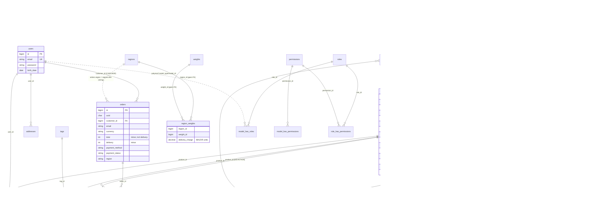

# 02 — Datamodel Concept500 → Quartermaster

> Bron: `/Users/wout-intractief/Documents/Concept` (Laravel 12, Backpack 6, Livewire 3).
> Geanalyseerd: alle 75 migraties (in volgorde toegepast), `database/seeders`, `app/Models`,
> `app/Casts/MoneyCasts.php`, `app/Enums`, `app/Dto`, `app/Observers`, `app/Listeners`,
> `app/Console/Commands` (o.a. `app:migrate-data`), relevante `app/Services` en `app/Payments`,
> `config/database.php`, `.env.example`, `docker-compose.yml`.
> Bijbehorend Prisma-concept: [`schema.draft.prisma`](./schema.draft.prisma) (gevalideerd met Prisma 6.6).

---

## 1. Samenvatting

- **Database**: MySQL-protocol, in de praktijk **MariaDB 10.11** (`docker-compose.yml`, `DB_CONNECTION=mysql`). Daarnaast een tweede connectie `old_database` (MySQL) — de *pre-Laravel* legacy shop, alleen gebruikt door de migratie-commando's.
- **31 domeintabellen + 8 framework-tabellen**. Geen sessions/cache-tabellen (`SESSION_DRIVER=file`, `CACHE_DRIVER=file`, `QUEUE_CONNECTION=sync`).
- **Geen vertalingen** (geen spatie/translatable, geen locale-kolommen). UI is Engelstalig, één taal.
- **Multi-currency is alleen weergave**: prijzen en orders worden opgeslagen in één shop-valuta (`settings.currency`, default EUR); conversie gebeurt runtime met koersen uit `currencies`.
- **Geld** in minor units (Int) via `brick/money` (`MoneyCasts`) — *behalve* `region_weights.delivery_charge`, `payment_methods.surcharge`, `currencies.exchange_rate` (decimal) en vermoedelijk `order_details.price` (bug, zie §8).
- **Media** = Cloudflare Images: alleen image-IDs opgeslagen als JSON in tekstkolommen.
- **Product = uniek item** (militaria): `quantity` meestal 0/1, `products.id` = legacy StockCode, zichtbaar in URL `/product/{id}/{slug}`.
- **Klant** is geen tabel: `Customer` is een virtueel Eloquent-model (GROUP BY `orders.email`). Gasten bestellen zonder account.
- Geen echte soft deletes, geen audit log, geen order-statushistorie, geen voorraadmutaties.

---

## 2. ER-overzicht

Losstaande tabellen (geen relaties): `contents`, `payment_methods`, `emailer_subscribers`, `emailer_mails`, `settings`, `currencies`, `import_log`, `jobs`, `failed_jobs`, `password_reset_tokens`, `personal_access_tokens`.

---

## 3. Tabellen (eindschema na alle migraties)

Alle tabellen hebben `id BIGINT UNSIGNED AI` en `created_at/updated_at TIMESTAMP NULL`, tenzij anders vermeld.

### 3.1 Catalogus

| Tabel | Kolommen (relevant) | Opmerkingen |
|---|---|---|
| **products** | `purchase_record_id` FK→purchase_records SET NULL; `product_id` bigint null; `category_id` FK→categories SET NULL; `title` varchar(250); `slug` varchar(250) (niet uniek); `description` text (Markdown); `price` int; `purchase_price` int null; `weight` int (gram); `quantity` int; `stock_control` varchar; `notes` text; `age_restricted`, `sale_item`, `blur` bool; `active` varchar; `photos` text; `photo_count` int; `sold_on` datetime; `sku` varchar; `product_reserved_on` datetime; `specifications` text (JSON); `importance` int | `id` = legacy StockCode, nieuwe producten vanaf 50000. Verwijderde kolommen: `list_index`, `bump_to_top`. Status wordt **afgeleid** (zie §4). `booted()`: prijs-velden uit request, `sold_on` reset bij herbevoorrading, bij delete pivots detachen + `DeleteProductPhotosJob` (Cloudflare), en bij update van ACTIVE producten `timestamps=false` zodat `updated_at` als *listing/bump-datum* blijft fungeren ("Bump to top" zet alleen `updated_at = now()`). |
| **categories** | `parent_id` FK self CASCADE; `title`; `slug` UK; `active` bool | 2 niveaus (categorie/subcategorie in filter). Id's komen uit legacy `Cat1.CatID`. Saved/deleted → `Cache::flush()`. |
| **tags** | `name`; `description` text (Markdown); `deleted_at` | `deleted_at` bestaat, maar model gebruikt **geen** `SoftDeletes` → dode kolom. |
| **product_tag** | `product_id` FK, `tag_id` FK (RESTRICT), eigen id + timestamps | Geen unique op (product_id, tag_id). |
| **related_products** | `product_id`, `related_product_id` FK→products CASCADE | Self-M:N, eenrichting. Feature-toggle `settings.related_products`. |
| **product_origins** | `name` | Herkomst/leverancier (feature-toggle `purchase_information`). |
| **purchase_records** | `product_origin_id` FK (NOT NULL — zie §8); `invoice_number` | Inkoopfactuur; N products → 1 record. Model-relaties zijn fout gedefinieerd (`belongsToMany` / `belongsTo` i.p.v. `hasMany`). |

### 3.2 Orders & klanten

| Tabel | Kolommen | Opmerkingen |
|---|---|---|
| **orders** | `uuid` char(36) (geen index/unique); `customer_id` FK→users **CASCADE**; `name`; `address` text; `delivery_address` text (ongebruikt); `phone`; `email`; `currency` varchar(3); `exchange_rate` int default 100 (ongebruikt); `delivery`, `tax`, `total` int (minor); `age_verify` default 'Not Required'; `payment_method` default 'btrans'; `payment_status` default 'failed'; `payment_id`; `payment_message`; `archive` bool; `email_sent_on` date; `order_paid_on` timestamp; `zip`, `city`, `state`, `country`, `region` varchar; `notes` text; `is_order_placed_event_fired` bool | `total` is **incl. verzendkosten**; `tax` wordt nooit gevuld. `comment` is vervangen door `notes`. `uuid` wordt gebruikt in de publieke status-URL (`order.status/{uuid}`). |
| **order_details** | `order_id` FK CASCADE; `product_id` FK NO ACTION; `description` text; `quantity`; `price`; `message` | `description` is altijd de letterlijke string `'description'` — **geen snapshot** van titel/sku. `price` = regeltotaal (zie §8 voor units-bug). |
| **addresses** | `user_id` FK (NOT NULL); `firstname`, `lastname`, `address`, `city`, `state` null, `zip` null, `country` | Adresboek ingelogde klant. Wordt **niet** aan orders gekoppeld (checkout kopieert waarden). |
| **wishlist** | `user_id`, `product_id` FK; UK(user_id, product_id) | |
| **payment_methods** | `name` UK ('Mollie', 'Paypal', 'Bank transfer', 'Cash'); `surcharge` decimal(10,2) = **percentage**; `visible`, `active` bool | Koppeling naar `orders.payment_method` via naamconversie (`MOLLIE`, `PAYPAL`, `BANK_TRANSFER`, `CASH`) in `PaymentStrategyFactory`. |
| *Customer* (virtueel) | — | `Customer` model = `SELECT MIN(id), email, MAX(name), MAX(phone), COUNT(*), SUM(total), MAX(created_at) FROM orders LEFT JOIN users ON email GROUP BY email`. Alleen Backpack-overzicht. |

**Orderflow** (`OrderService::processOrder`): stock-check met `lockForUpdate` → `Order::create` (currency = shop-valuta, `region` = titel uit sessie) → `OrderDetail::insert`. Betaling via strategy (Mollie/PayPal → `paid`/`failed`; Bank/Cash → `manual`). `OrderPlaced` event → listeners `UpdateStock` (quantity −= qty, `sold_on` bij 0, `timestamps=false`), `SendOrderPaidMails` (idempotent via `email_sent_on`), `ForgetBasketSession`; `is_order_placed_event_fired` voorkomt dubbel vuren. Admin kan handmatig "Paid" zetten (`order_paid_on`, `payment_status='paid'`).

**Payment status-waarden in data**: `paid`, `manual`, `failed` (oude `pending` → `failed` in migratie 2026_07_28; default nu `failed`). Mogelijk nog legacy `btrans` als payment_method default.

### 3.3 Verzending

| Tabel | Kolommen | Opmerkingen |
|---|---|---|
| **regions** | `title` | Klant kiest regio in mandje (sessie). |
| **weights** | `weight` int (gram) | Seed: 1, 50, 100, 250, 500, 1000 … 30000. |
| **region_weights** | `region_id`, `weight_id` (**geen FK's**), `delivery_charge` decimal(8,2) **major units**; UK(region_id, weight_id) | Tarief = eerste gewichtsklasse ≥ totaalgewicht mandje. |

### 3.4 Valuta

| Tabel | Kolommen | Opmerkingen |
|---|---|---|
| **currencies** | `code` (niet uniek); `exchange_rate` decimal(8,2) | Seed: EUR, USD, GBP, AUD, JPY, CAD, CNY, NZD (rate 0). `app:update-currencies-command` haalt koersen via `ashallendesign/laravel-exchange-rates` t.o.v. `settings.currency`; basisvaluta krijgt rate 1. Cache 60 min (`{shopname}_currencies`). |

### 3.5 CMS

| Tabel | Kolommen | Opmerkingen |
|---|---|---|
| **contents** | `page` (ShopPageEnum); `title` null; `content` text (Markdown); `url`; `start_date`, `end_date` date; `active` bool null; `contact` text (JSON); `parent_id` int default 0; `lft/rgt/depth` | "Oude" CMS: losse items per vaste pagina (terms, privacy, links, events, news, about, banner…). Gevuld vanuit legacy tabellen `Privacy`, `Terms`, `Links`, `events`, `Info`, `News`. `ContentObserver` is leeg. |
| **content_pages** | `url` UK; `title`; `slug` UK | Pagebuilder-pagina's (migratie maakt `home`). |
| **content_blocks** | `content_page_id` FK CASCADE; `product_id` FK SET NULL; `type` (ContentBlockTypeEnum); `title`; `content`; `author`; `media_type`; `image` text (JSON CF ids); `background_color`; `button_link`; `site_link`; `link_text`; `amount`; `order` | "God table": kolommen per bloktype wisselend gebruikt. Seed-migratie schrijft **absolute URL's** (`url('/shop')`) in de DB. |
| **menu_items** | `location` (HEADER/FOOTER); `main_name`, `url`, `sub_name`, `sub_url`; `order`; `parent_id` FK self CASCADE; `lft/rgt/depth` | Rare `saving` hook: item zonder `parent_id` wordt **verwijderd** bij opslaan; kinderen erven location/naam van parent. Seed-migratie verwijst naar `parent_id = 4` (Contact) terwijl de footer-root id 5 is. |

### 3.6 Settings

**settings**: `key` UK, `value`, `role` (OWNER/ADMIN — wie mag wijzigen in Backpack), `title`, `description`, `setting_type` (string|boolean|int|enum|image|list), en per type een kolom: `string_value`, `boolean_value` (*varchar*), `int_value` (*varchar*), `list_value` (gekozen enum-waarde), `image_value` (varchar(255), JSON CF ids), `list` (json). Accessor `getValueAttribute` kiest de juiste kolom. `LoadSettingsMiddleware` laadt alles in `config('settings.*')` (gecached). Bekende keys (seeders + migraties):

`shop_name, currency, email, timezone, logo, banner_image, cta_image, confirmation_message, default_specs, product_specifications, related_products, purchase_information, matomo_id, toggle_banner_homepage, toggle_banner_pages, product_import, default_sku, toggle_archive_page, text_font, heading_font, primary_color, secondary_color, tertiary_color, emailer, emailer_quota, about, age_verify, banner, contact, direct_checkout, endless_scrolling, events, home_shop, links, list_or_grid_view, maximum_item_photos, maximum_items, news, privacy, product_blur, reserved_time, share_on_socials, shop_display_amount, shop_selected_filter, show_emailer_popup, show_price_when_sold, show_purchase_price, show_tags, sku, subscription_type, terms, toggle_bump_to_top, toggle_contact_form, toggle_gridview_stock_code, toggle_listview_stock_code, toggle_order_archive_page, toggle_packing_slip_prices, toggle_price_range, toggle_product_importance, toggle_stolen_status`.

Veel van deze keys zijn **feature flags / theming** van het multi-tenant "Concept"-product (Intractief), niet specifiek voor deze shop.

### 3.7 Nieuwsbrief ("Emailer")

| Tabel | Kolommen | Opmerkingen |
|---|---|---|
| **emailer_subscribers** | `email_address` UK; `verification_code`; `verification_status` (pending/active/unsubscribed); `resend_attempts`; `email_sent_at`; `email_verified_at`; `last_updated_by_ip` | Double opt-in. Code dient ook als unsubscribe-token. Legacy statussen −3/0/−2 → pending/active/unsubscribed. |
| **emailer_mails** | `subject`; `content`; `sent_at`; `sent_count` | Mailings; quotum in `settings.emailer_quota`. Verzending via `SendEmailerMail` job, mailer `newsletter`. |

### 3.8 Framework / Backpack / spatie

| Tabel | Bron | Gebruik | In Quartermaster |
|---|---|---|---|
| `users` | Laravel | Klanten + admins (één tabel); `birth_date` verplicht (leeftijdscheck `is_adult`) | **Behouden** (→ auth-library user) |
| `password_reset_tokens` | Laravel | wachtwoord-reset | **Obsoleet** (auth-library verification tokens) |
| `personal_access_tokens` | Sanctum | alleen default `GET /api/user` | **Obsoleet** |
| `roles`, `permissions`, `model_has_roles`, `model_has_permissions`, `role_has_permissions` | spatie/laravel-permission + backpack/permissionmanager | 3 rollen: `user`, `owner`, `admin`; permissions vermoedelijk leeg | **Obsoleet** → `User.role` enum |
| `jobs` | Laravel queue (database driver) | photo upload/delete, emailer | **Obsoleet** (Inngest / pg-boss / BullMQ / Vercel cron) |
| `failed_jobs` | Laravel | | **Obsoleet** |
| `import_log` | redsquirrelstudio/laravel-backpack-import-operation | CSV product-import | **Obsoleet** (eigen import-feature indien nodig) |
| `migrations` | Laravel | | **Obsoleet** (→ `_prisma_migrations`) |
| sessions / cache | — | file driver, geen tabel | n.v.t. |

---

## 4. Enums

Laravel slaat **pure** PHP enums op als de **case-naam** (VARCHAR). Backed enums slaan de value op.

| Enum | Type | Waarden | Kolom |
|---|---|---|---|
| `ActiveTypeEnum` | pure | `INACTIVE`, `ACTIVE`, `ARCHIVED` | `products.active` |
| `StockControlTypeEnum` | pure | `RESERVED` (gereserveerd bij 0 voorraad), `SOLD` (verkocht bij 0), `STOLEN`, `NOT_IN_SHOP` | `products.stock_control` |
| `ProductStatusEnum` | pure, **niet opgeslagen** | `ACTIVE`, `STOLEN`, `SOLD`, `RESERVED`, `ARCHIVED` | afgeleid in `ProductStatusService` uit active + quantity + stock_control + `product_reserved_on` (< `settings.reserved_time` sec en qty ≤ 1) |
| `ContentBlockTypeEnum` | pure | `TEXT`, `TEXT_HORIZONTAL`, `TEXT_IMAGE`, `QUOTE`, `CTA`, `TESTIMONIAL`, `NEW_ITEMS`, `GALLERY`, `CATEGORIES`, `HERO`, `TEXT_PRODUCT`, `TEXT_CAROUSEL`, `EMAILER` | `content_blocks.type` |
| `MediaTypeEnum` | pure | `IMAGE`, `BACKGROUND_COLOR` | `content_blocks.media_type` |
| `MenuItemLocationEnum` | pure | `HEADER`, `FOOTER` | `menu_items.location` |
| `ShopPageEnum` | backed string | `HOME`, `SHOP`, `TERMS`, `LINKS`, `PRIVACY`, `CONTACT`, `EVENTS`, `NEWS`, `BANNER`, `ABOUT` | `contents.page` |
| `SettingTypeEnum` | backed string | `string`, `boolean`, `int`, `enum`, `image`, `list` | `settings.setting_type` |
| `EmailerStatusEnum` | backed string | `pending`, `active`, `unsubscribed` | `emailer_subscribers.verification_status` (**zonder cast** op model) |
| *(impliciet)* payment_status | string | `paid`, `manual`, `failed` (+ historisch `pending`) | `orders.payment_status` |
| *(impliciet)* payment_method | string | `MOLLIE`, `PAYPAL`, `BANK_TRANSFER`, `CASH` (+ default `btrans`) | `orders.payment_method` |

Statuslogica product (prioriteit): ARCHIVED → SOLD (qty 0 & SOLD) → STOLEN (qty 0 & STOLEN) → RESERVED (recent gereserveerd of qty 0 & RESERVED) → ACTIVE. `ArchiveOldProducts` zet `active=ARCHIVED` als `sold_on` > 2 weken oud.

---

## 5. Geld

- **Library**: `brick/money` 0.8. `MoneyCasts`: DB-int ↔ `Money::ofMinor($value, config('settings.currency'))`. Bij schrijven: `Money` → `getMinorAmount()`, of scalar → `Money::of($value)` (major!) → minor.
- **Valuta komt uit config, niet uit de rij**: ook voor `orders` (dat een eigen `currency` kolom heeft) leest de cast `settings.currency`. Werkt alleen zolang de shop-valuta nooit wijzigt.
- **Gecaste kolommen (minor units, Int)**: `products.price`, `products.purchase_price`, `orders.total`, `orders.delivery`, en (onzinnig) `orders.exchange_rate`.
- **Niet gecast / decimal (major units)**: `region_weights.delivery_charge` decimal(8,2); `payment_methods.surcharge` decimal(10,2) = percentage; `currencies.exchange_rate` decimal(8,2).
- **Weergave**: `CurrencyService::getLocaleFromCurrency` (EUR→nl_NL, GBP→en_GB, …), conversie via `CurrencyConverter` met `RoundingMode::DOWN`.
- **Surcharge**: `BasketDTO::getFormattedFullCosts($surcharge)` vermenigvuldigt totaal met `1 + surcharge/100` (RoundingMode::UP) — alleen voor weergave; onduidelijk of de toeslag in `orders.total` terechtkomt (zie Open vragen).
- **Doel**: alle bedragen `Int` (minor) + `currency Char(3)` per rij. Gebruik in TS `dinero.js` v2 of eigen `Money` helper; nooit floats. Percentages als basispunten (Int).

---

## 6. Vertalingen & multi-currency

- **Vertalingen**: geen. Geen `*_translations` tabellen of JSON-locale kolommen. Alle content (titels, beschrijvingen) is enkeltalig (Engels/NL gemengd per shop-eigenaar).
  → Als Quartermaster i18n wil: kies nu tussen (a) `ProductTranslation(productId, locale, title, slug, description, seo*)` of (b) JSON-kolommen per locale. Advies: (a), maar pas invoeren als er echt een 2e taal komt.
- **Multi-currency**: alleen *display*. Klant kiest valuta in sessie (`Session::exchange_rate`), prijzen worden omgerekend; **checkout en order gebeuren altijd in shop-valuta** (Mollie krijgt `orders.currency` + `total`). `orders.exchange_rate` wordt niet gezet.
  → Doel: `ExchangeRate` historie-tabel (Decimal(18,8)) + op de order `displayCurrency` en `displayRate` als snapshot, zodat later te reconstrueren is wat de klant zag.

---

## 7. Media / Cloudflare Images

- Opslag: **Cloudflare Images** (`foodticket/laravel-cloudflare`). URL: `https://imagedelivery.net/{account_hash}/{image_id}/{variant}`; varianten `public` en `blur` (voor `blur`-producten bij gasten).
- In DB alleen image-IDs:
  - `products.photos` — TEXT met JSON-array, cast `array`. **Vaak dubbel ge-encodeerd** (`SyncCloudflareImages` en `UploadProductPhotosJob` doen zelf `json_encode` bovenop de cast; `ReorderPhotos` bevat expliciet een workaround). Volgorde = weergavevolgorde; eerste = thumbnail.
  - `products.photo_count` — verwacht aantal uit legacy (`PhotoQuant`).
  - `content_blocks.image` — JSON-array (cast `array`, accessors doen nog eens `json_decode`).
  - `settings.image_value` — JSON-array in VARCHAR(255) (logo, banner_image, cta_image).
- Legacy bestandsnaamconventie: `{StockCode}.jpg`, `{StockCode}a.jpg` … `{StockCode}z.jpg` (`LOCAL_PHOTOS_DIR`). `SyncCloudflareImages`/`SyncProductPhotos` matchen CF-bestandsnaam → product.
- Delete product → `DeleteProductPhotosJob` verwijdert images bij Cloudflare (na commit).
- **Doel**: tabel `ProductImage(productId, cloudflareId UK, position, alt, width, height, filename)`. IDs blijven geldig — **geen re-upload nodig**. ETL moet beide encodings (enkel/dubbel JSON) robuust parsen. Settings-images → `MediaAsset` of JSON-setting.

---

## 8. Soft deletes, polymorfie, data-kwaliteit & tech debt

### Soft deletes
- Alleen `tags.deleted_at` bestaat, maar zonder `SoftDeletes` trait → **geen soft deletes in gebruik**. "Archiveren" van producten gebeurt via `active = ARCHIVED`, van orders via `archive = 1`.
- Gevolg: harde deletes. `orders.customer_id ON DELETE CASCADE` → **user verwijderen = orders weg**. `order_details.product_id NO ACTION` → product met orders kan niet verwijderd worden (FK-error).

### Polymorfe relaties
- `personal_access_tokens (tokenable_type, tokenable_id)` — Sanctum.
- `model_has_roles` / `model_has_permissions (model_type, model_id)` — spatie; `model_type` = `App\Models\User` (migratie `remove_backpackuser_model` herschrijft naar `App\User` — mogelijk legacy waarden).
- Geen applicatie-eigen polymorfie (geen `morphTo` in `app/Models`).

### Data-kwaliteit / bugs (te verifiëren op productie-dump)
1. **`order_details.price` units**: `OrderService` doet `OrderDetail::insert([... 'price' => $price->multipliedBy($qty)->getAmount()])` — `insert()` omzeilt de cast en `getAmount()` is **major** (bv. `"125.00"`). In een INT-kolom wordt dat 125 (of afgerond/strict-error bij centen). Waarschijnlijk: regeltotalen in **hele euro's**, niet centen. Controle: `SUM(od.price)` vs `o.total - o.delivery`.
2. **`order_details.description`** = altijd `'description'`; geen titel/SKU-snapshot. Orderhistorie hangt volledig af van de (muteerbare) productrij.
3. **Dubbel ge-encodeerde JSON** in `products.photos` (zie §7); `products.specifications` als TEXT-JSON.
4. **`orders.uuid`** is later toegevoegd als NOT NULL zonder default → oude rijen hebben `''`; geen unique index.
5. **`orders.exchange_rate`** (default 100, Money-cast) en **`orders.tax`** (altijd 0) en **`orders.delivery_address`** ongebruikt.
6. **`orders.region`** = string-snapshot van `regions.title`, geen FK; `orders.country` vrij formaat (geen ISO-code gegarandeerd).
7. **Adres als vrije tekst**: `orders.name` = voor+achternaam samengevoegd; `address` = straat+nr in één veld.
8. **Geen customer-entiteit**: klantidentiteit = e-mailadres (case-gevoeligheid/typo's → gesplitste klanten).
9. **`products.slug` niet uniek**, `sku` niet uniek/geïndexeerd; SKU-generatie `max(sku)+1` via string-sortering (race condition). `products.product_id` (start 5001) heeft onduidelijk doel.
10. **`updated_at` als listing-datum**: bewust niet bijgewerkt bij edits van actieve producten; "bump" = `updated_at = now()`; `created_at` overschreven met legacy `DateAdded` (`app:sync-date-added-to-created-at`). → Geen betrouwbare audit-timestamps.
11. **Ontbrekende FK's**: `region_weights` (`unsignedBigInteger()->constrained()` is een no-op), `contents.parent_id` (0 i.p.v. NULL), `import_log.user_id`.
12. **Onbedoeld NOT NULL**: `addresses.user_id`, `purchase_records.product_origin_id` (`->constrained()->nullable()` werkt niet zo).
13. **Uniciteit ontbreekt**: `currencies.code`, `tags.name`, `product_tag(product_id, tag_id)`.
14. **`currencies.exchange_rate` decimal(8,2)** — te weinig precisie (GBP ≈ 0.85 → tot ~0,6% fout; CNY/JPY ok).
15. **Settings-EAV**: booleans/ints als strings, `value`-kolom deels gebruikt; image JSON in VARCHAR(255).
16. **`EmailerSubscriber.verification_status` zonder enum-cast**: `SendEmailerVerificationEmail` vergelijkt `=== EmailerStatusEnum::PENDING` (enum vs string). Afhankelijk van instance-state (net gezet = enum) werkt het, na reload niet — fragiel.
17. **`app:migrate-data`**: `where('remove', '==', '0')` is geen geldige Laravel-operator → wordt `remove = '=='` → vermoedelijk **0 subscribers gemigreerd** via deze route (of handmatig hersteld). Producten: `insertOrIgnore` + niet-gevonden prijs → 0 (gelogd). Categorie-slugs zonder de-duplicatie.
18. **MenuItem `saving` hook** verwijdert items zonder `parent_id`; seed verwijst naar verkeerde parent (4 i.p.v. 5). Absolute URL's (`url('/shop')`) in `menu_items` en `content_blocks` → breken bij domeinwissel.
19. **Mollie `handle()`**: in de `else`-tak wordt `$order->update()` aangeroepen op een int (`$order` is het order-id) → failed status wordt niet opgeslagen; daarom staat default nu op `failed`.
20. **Model-relaties fout**: `ProductOrigin::purchaseRecords` (belongsToMany zonder pivot), `PurchaseRecord::product` (belongsTo zonder kolom). `Address` fillable `default` zonder kolom.
21. **Reservering** (`product_reserved_on`) is een timestamp op het product zelf — geen relatie met sessie/klant; meerdere gelijktijdige checkouts niet te onderscheiden.
22. **Voorraad**: alleen `quantity` muteert (in listener na betaling/placement); geen ledger → niet te reconstrueren waarom voorraad wijzigde.
23. **PII**: `emailer_subscribers.last_updated_by_ip`, `users.birth_date` — AVG-retentie ontbreekt.

---

## 9. Voorstellen voor het nieuwe schema

> In `schema.draft.prisma` gemarkeerd als `// NEW:`. Nieuwe tabellen hebben prefix `qm_` zodat ze naast de legacy tabellen kunnen bestaan.

1. **Database**: PostgreSQL (Neon/Supabase/RDS). Voordelen: `tsvector`/`pg_trgm` full-text, betere JSONB, partial indexes, `CHECK` constraints, native enums. Prisma ondersteunt beide; met optie (b) is de engine-keuze vrij.
2. **ID's**: `Int`/`BigInt` autoincrement of `cuid2` voor nieuwe entiteiten; **products houden hun numerieke id/StockCode** (URL's, fysieke labels, klantcommunicatie). Leg `stockCode` expliciet vast (uniek) los van de PK als je naar cuid gaat.
3. **Product**
   - `status ProductStatus` opgeslagen (DRAFT/ACTIVE/RESERVED/SOLD/STOLEN/NOT_IN_SHOP/ARCHIVED) i.p.v. afleiden uit 4 velden; `stockControl` blijft als *policy* bij voorraad 0.
   - `publishedAt` / `bumpedAt` i.p.v. misbruik `updated_at`; `updatedAt` weer echt.
   - `slug` uniek (de-dupliceren met suffix) — URL `/product/{id}/{slug}` kan blijven, slug alleen cosmetisch + redirect bij mismatch.
   - `sku` uniek + DB-sequence voor generatie.
   - SEO: `seoTitle`, `seoDescription`, `ogImageId`; idem op Category en ContentPage.
   - `ProductImage` (zie §7), `ProductSpec` (key/value, positie) i.p.v. JSON.
   - `ProductVariant` **optioneel**: huidige domein = unieke items; alleen invoeren als er serie-artikelen (maten, reproducties) komen. Ontwerp zo dat een product zonder varianten gewoon werkt.
   - Soft delete (`deletedAt`) zodat orderhistorie intact blijft.
4. **Voorraad-ledger** `StockMovement(productId, variantId?, delta, reason, orderId?, actorId?, note)`; `products.quantity` = gecachte som, bijgewerkt in dezelfde transactie. Reserveringen als aparte `Reservation(productId, cartId, expiresAt)` met TTL i.p.v. timestamp op product.
5. **Orders**
   - Leesbaar `number` (uniek), `uuid` uniek (publieke status-URL).
   - `OrderStatus` state machine + `OrderStatusHistory` (from/to/actor/note/timestamp).
   - `Payment` tabel (provider, providerPaymentId uniek, status, amount, currency, surcharge, rawPayload, paidAt) — meerdere pogingen/refunds, idempotente webhooks.
   - `OrderItem` snapshot: `productTitle`, `sku`, `unitPrice`, `quantity`, `lineTotal` (minor), `imageId`.
   - Bedragen: `subtotal`, `shippingTotal`, `surchargeTotal`, `taxTotal`, `grandTotal` + `currency`; `displayCurrency`/`displayRate`.
   - `OrderAddress` (billing/shipping, gestructureerd, `countryCode` ISO-2).
   - `customerId` → `onDelete: SetNull` (nooit cascaden).
6. **Klanten**: optioneel `Customer` tabel (email uniek, lowercase) waar zowel gasten als users naar verwijzen → klant-historie zonder GROUP BY-hack.
7. **Verzending**: `ShippingZone` (= region) met `countries String[]` (ISO-2) zodat zone automatisch uit land volgt; `ShippingRate(zoneId, maxWeightGrams, price Int minor)` met FK's en unique(zoneId, maxWeightGrams).
8. **Valuta**: `Currency(code PK Char(3), enabled)` + `ExchangeRate` historie (Decimal(18,8)).
9. **Settings**: één tabel `Setting(key PK, value Json, updatedAt, updatedBy)` + **typed registry in code** (zod) met defaults; feature flags die niet meer nodig zijn schrappen (multi-tenant "Concept"-flags).
10. **CMS**: `contents` + `content_pages/blocks` samenvoegen tot `Page` + `Block(type, data Json, position)` met zod discriminated union; relatieve URL's. Of CMS uitbesteden (Payload/Sanity) — los besluit.
11. **Audit log** `AuditLog(actorId, entityType, entityId, action, diff Json, ip, createdAt)` via Prisma client extension/middleware voor admin-mutaties.
12. **Full-text search**: Postgres `tsvector` (generated column op title+description+sku+tags, `simple`/`dutch` config) + GIN index; `pg_trgm` voor fuzzy op titel en zoeken op StockCode. Prisma: `Unsupported("tsvector")` + raw SQL in migratie.
13. **Auth**: Auth.js / better-auth tabellen (User, Account, Session, VerificationToken); rol als enum op User. Bcrypt-hashes (`$2y$`) zijn overdraagbaar (bcryptjs accepteert `$2y$`; anders prefix → `$2b$`), rehash bij eerste login naar argon2id.
14. **Nieuwsbrief**: `NewsletterSubscriber` met status-enum, `consentAt`, `unsubscribedAt`, token apart van verificatiecode; overweeg uitbesteden (Resend audiences / Mailchimp).
15. **Redirects** tabel voor SEO-behoud bij URL-wijzigingen.
16. **Indexen**: `products(status, publishedAt)`, `products(categoryId, status)`, `orders(email)`, `orders(createdAt)`, `orders(uuid)` uniek, `payments(providerPaymentId)` uniek.

---

## 10. Data-migratie strategie

### Optie (a) — `prisma db pull` op bestaande DB en die houden
- Werkwijze: kopie van de MariaDB, `prisma db pull`, modellen hernoemen (`@map`), Next.js app draait direct op het bestaande schema; daarna incrementeel `prisma migrate` (baseline met `migrate resolve --applied`).
- **Voordelen**: geen ETL; snelle start; Laravel en Next.js kunnen tijdelijk naast elkaar op dezelfde DB draaien (strangler pattern).
- **Nadelen**: erft alle tech debt (§8): VARCHAR-enums (Prisma enums vereisen native `ENUM` op MySQL → blijft `String`), BigInt-ID's (TS `bigint` overal), dubbel-ge-encodeerde JSON, settings-EAV, ontbrekende FK's, `updated_at`-semantiek, CASCADE op orders. Blijft MariaDB (geen tsvector). Elke "fix" wordt een migratie op een levende, door Laravel gedeelde DB → coördinatie tussen twee codebases. Laravel-specifieke tabellen (jobs, spatie, sanctum) blijven rondslingeren.

### Optie (b) — nieuw schoon schema + ETL-script
- Werkwijze:
  1. Productie-dump → lokale MariaDB (docker) als **bron**.
  2. `schema.draft.prisma` (dit bestand, mapped) als **read-only legacy client** (aparte `output`) — of Kysely/mysql2.
  3. Nieuw Quartermaster schema (Postgres) met eigen Prisma client.
  4. TypeScript ETL (`scripts/etl/*.ts`), per domein, **idempotent** (upsert op legacy id), in volgorde: users → categories/tags/origins → products (+ images uit photos JSON, specs, tags, related) → shipping → currencies → orders (+ items, payments, addresses, status history afgeleid uit payment_status/order_paid_on/archive) → CMS → settings → newsletter.
  5. Transformaties: JSON-decode (enkel/dubbel), enum-mapping, `order_details.price` normaliseren na verificatie, adres-parsing best-effort, country → ISO-2, delivery_charge decimal → minor, surcharge → basispunten, `updated_at` → `publishedAt`.
  6. Validatie-rapport: row counts per tabel, `SUM(total)` per maand, aantal producten per status, steekproef 50 orders/producten, foto-aantallen vs `photo_count`.
  7. Dry-runs herhalen tot rapport schoon is; cutover = korte freeze → laatste delta-run (orders/products sinds vorige run op `id`/`updated_at`) → DNS-switch. Mollie/PayPal webhooks omzetten.
  8. Redirect-tabel vullen voor gewijzigde URL's (Laravel routes → Next.js routes).
- **Voordelen**: schoon, getypeerd domeinmodel; Postgres-features; data-issues worden één keer expliciet opgelost en gedocumenteerd; herhaalbaar en testbaar; legacy blijft onaangetast als fallback.
- **Nadelen**: ETL bouwen en onderhouden (~2–4 dagen werk bij deze omvang); cutover vereist freeze-moment; geen parallel draaien op dezelfde DB.

### Aanbeveling: **optie (b)**
1. De datahoeveelheid is naar verwachting beperkt (één shop; exacte aantallen nog onbekend, zie Open vragen) → ETL is goedkoop en snel te herhalen.
2. Het grootste deel van de waarde van de migratie zit juist in het oplossen van §8 (order snapshots, status, geldunits, foto-JSON, voorraad); met (a) blijven die structureel aanwezig.
3. Quartermaster vervangt Laravel volledig; er is geen noodzaak voor langdurig parallel gebruik van één DB.
4. Postgres + full-text search + native enums zijn alleen met (b) realistisch.
5. (a) blijft nuttig **als hulpmiddel**: `schema.draft.prisma` is precies de mapped legacy-client voor de extractiestap — het beste van beide.

Randvoorwaarden: product-ID's (StockCodes) en Cloudflare image-ID's 1-op-1 behouden; order-ID's behouden (klantcommunicatie, boekhouding); wachtwoord-hashes meenemen.

---

## 11. Open vragen

1. **`order_details.price`**: staan regeltotalen in hele euro's (major) of centen? Verifiëren met `SUM(order_details.price)` vs `orders.total - orders.delivery` op de productie-dump.
2. **Surcharge**: komt de payment-method toeslag in `orders.total` terecht of is het alleen weergave? Welke methodes hebben een toeslag?
3. **Database-keuze**: akkoord met PostgreSQL voor Quartermaster, of moet het MariaDB/MySQL blijven (hosting, Plesk)?
4. **Volumes**: aantal products / orders / users / subscribers en grootte van de productie-DB? Hoeveel Cloudflare images?
5. **`products.product_id`**: wat is het doel van dit tweede nummer (start 5001)? Wordt het extern gebruikt (labels, boekhouding)?
6. **SKU vs StockCode**: wat is leidend voor de eigenaar — `id` (StockCode) of `sku`? Mag één van beide vervallen?
7. **Varianten**: komen er ooit niet-unieke artikelen (maten, reproducties, boeken in oplage)? Bepaalt of `ProductVariant` nu nodig is.
8. **Vertalingen**: is meertaligheid (NL/EN/DE) een doel voor Quartermaster?
9. **Multi-currency checkout**: moet de klant ook in vreemde valuta kunnen *betalen* (Mollie ondersteunt dat), of blijft het weergave-only?
10. **Klantaccounts**: blijft gast-checkout de norm? Mogen gast-orders achteraf aan een account gekoppeld worden (op e-mail)?
11. **Leeftijdsverificatie**: `users.birth_date` verplicht en `orders.age_verify` — wat is de juridische eis (welke producten, welke landen)? Bepaalt of geboortedatum moet blijven (AVG).
12. **Settings / multi-tenant**: is Quartermaster single-tenant (alleen deze shop) of moet het, net als "Concept", meerdere shops met feature flags ondersteunen?
13. **CMS**: eigen pagebuilder behouden (blocks) of uitbesteden aan een headless CMS?
14. **Nieuwsbrief**: eigen verzending behouden (quotum, `emailer_mails`) of naar externe dienst?
15. **Historische data**: moeten gearchiveerde producten (SOLD/ARCHIVED, foto's bij Cloudflare) volledig mee, of alleen de laatste N jaar? (kosten Cloudflare Images)
16. **Legacy `old_database`**: bestaat die nog / is er data die nooit gemigreerd is (bv. emailer subscribers door de `'=='` bug, oude orders)?
17. **Spatie permissions**: zijn er naast de rollen user/owner/admin echte permissions in gebruik? (Verwachting: nee.)
18. **Prisma-versie**: Prisma 7/8 verplaatst de datasource-URL naar `prisma.config.ts`; welke versie kiezen we als basis voor Quartermaster?
