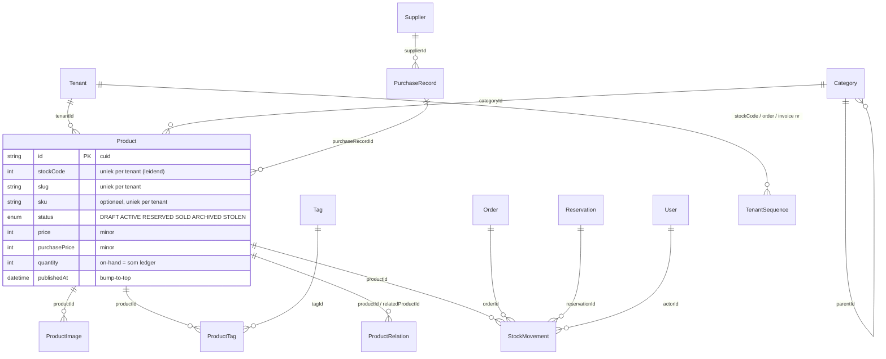
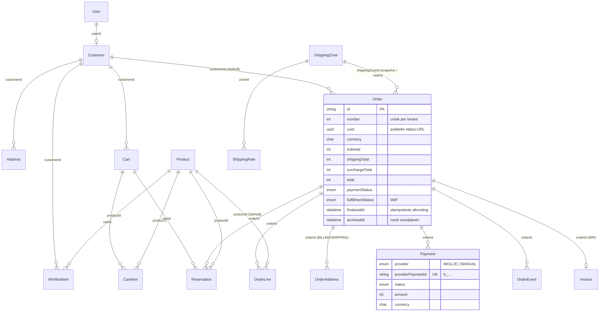
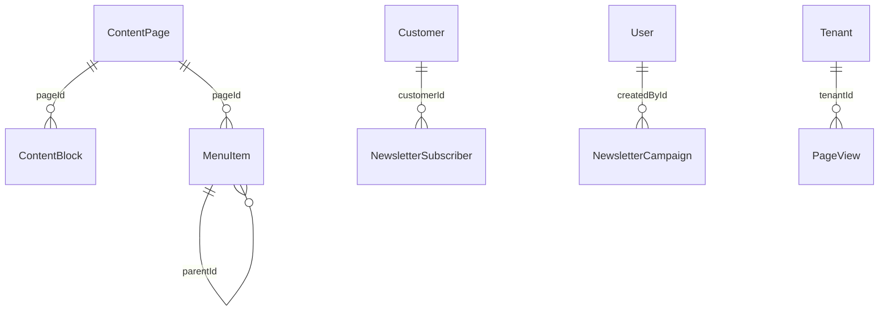

# Datamodel — Quartermaster

Bron van waarheid: `prisma/schema.prisma`. Migraties: `prisma/migrations/` (`foundation`, `domain_phase1`).
Besluiten: `02-besluiten.md`. Legacy-analyse: `analysis/02-data-model.md`, `analysis/04-testdump-bevindingen.md`.

## 1. ER-overzicht

### Catalogus, inkoop, voorraad



### Klanten, mandje, orders, betalingen, verzending



### Content, nieuwsbrief, analytics



Alle domeintabellen hebben `tenantId → tenants.id` (niet getekend).

## 2. Kernbeslissingen

### Tenancy
- **Elke** shop-tabel heeft `tenantId`, ook kindtabellen (`OrderLine`, `ProductImage`, `ShippingRate`, `ProductTag`, …). Zo kan de Prisma-extension op elk model uniform `where: { tenantId }` afdwingen, zonder te hoeven weten via welke ouder een rij bij een tenant hoort.
- Uniciteit is per tenant: `@@unique([tenantId, slug])`, `[tenantId, stockCode]`, `[tenantId, number]`, `[tenantId, email]`, …
- Cross-tenant consistentie (bijv. `OrderLine.tenantId == Order.tenantId`) wordt **niet** met samengestelde FK's afgedwongen (botst met `SetNull`-relaties in Prisma); dat bewaakt de service-laag + extension. Kan later met triggers als nodig.
- `onDelete` richting `Tenant`: **Restrict** voor commerciële data (producten, orders, klanten, content), **Cascade** alleen voor vluchtige data (carts, reserveringen, wishlist, pageviews, sequences). Een tenant verwijder je niet; je zet `status = ARCHIVED`. Hard purgen = apart script.

### ID's en nummering
- PK's zijn `cuid`-strings (zoals de foundation). Mens-leesbare nummers zijn aparte per-tenant `Int`'s:
  - `Product.stockCode` — **leidend ID** (besluit 26). Legacy `products.id` gaat 1-op-1 naar `stockCode`. URL blijft `/product/{stockCode}/{slug}`.
  - `Order.number` — legacy `orders.id` blijft behouden.
  - `Invoice.number` (WIP).
- Uitgifte via `TenantSequence(tenantId, name, value)` met één atomaire statement in dezelfde transactie:
  ```sql
  INSERT INTO tenant_sequences ("tenantId", name, value, "updatedAt") VALUES ($1, 'order.number', 1, now())
  ON CONFLICT ("tenantId", name) DO UPDATE SET value = tenant_sequences.value + 1, "updatedAt" = now()
  RETURNING value;
  ```
  Startwaarden: `product.stockCode` → 50000 (legacy-conventie); na ETL de sequence op `max(...)` zetten. Rij-lock op de sequence serialiseert gelijktijdige uitgifte per tenant; bij rollback ontstaan geen gaten.
  Geen Postgres `SEQUENCE` per tenant: die zijn niet transactioneel (gaten) en vereisen DDL per nieuwe tenant.

### Geld
- Alle bedragen `Int` in **minor units** (centen). Nooit floats.
- Catalogusprijzen (`Product.price`, `purchasePrice`, `ShippingRate.price`) staan in de tenant-valuta (`Tenant.currency`).
- Opgeslagen bedragen op `Order`, `Payment`, `PurchaseRecord`, `Invoice` hebben een eigen `currency Char(3)` (CHECK `^[A-Z]{3}$`). Valutawissel is alleen weergave (besluit 17); geen `displayCurrency/rate` snapshot opgeslagen (kan later).
- CHECK-constraints: bedragen ≥ 0, `amountRefunded ≤ amount`, `quantity > 0` op regels.

### Productstatus
- Eén opgeslagen `status` (besluit 11): `DRAFT · ACTIVE · RESERVED · SOLD · ARCHIVED · STOLEN`. Betekenis/transities worden later vastgelegd in de service (`src/server/products`).
- `publishedAt` vervangt de legacy `updated_at`-truc: "bump to top" = `publishedAt = now()`. `updatedAt` is weer een echte wijzigingsdatum.
- Index `[tenantId, status, publishedAt DESC]` voor de shoplijst; `[tenantId, categoryId, status]` voor categoriepagina's.
- Flags: `ageRestricted`, `blurred` (gevoelig → blur + login voor gasten), `acceptsOffers`, `restrictedSymbols` (compliance-weergave), `onSale`, `importance`.
- Full-text search komt later (gegenereerde `tsvector` + GIN, `pg_trgm` op titel) in een eigen migratie.

### Reservering (15 min)
- `Reservation(productId, cartId?, orderId?, quantity, status, expiresAt)`. Statussen: `ACTIVE → CONVERTED | RELEASED | EXPIRED`.
- **Maximaal één ACTIVE reservering per product**: partiële unique index `reservations_active_product_key ON reservations(productId) WHERE status='ACTIVE'` (handgeschreven SQL in `domain_phase1`).
- `expiresAt` mag niet in een index-predicaat (`now()` is niet immutable). Reserveer-flow daarom in één transactie: (1) `UPDATE reservations SET status='EXPIRED', releasedAt=now() WHERE productId=$1 AND status='ACTIVE' AND expiresAt < now()`, (2) `INSERT` ACTIVE. Unique-violation (`P2002`) = "iemand anders heeft het in het mandje". Daarnaast ruimt een cron/pg-boss job verlopen rijen op.
- Bij checkout wordt `orderId` gezet en `expiresAt` verlengd zolang de Mollie-betaling open staat; bij betaald → `CONVERTED`, bij failed/expired → `RELEASED`.
- Aanname: producten zijn unieke items. Komen er serie-artikelen (qty > 1) dan vervalt deze index en wordt `available = quantity − Σ ACTIVE.quantity` met een lock op de productrij gecontroleerd.

### Voorraad-ledger
- `StockMovement` is append-only; `Product.quantity` = **on-hand** = Σ `delta`, bijgewerkt in dezelfde transactie; `quantityAfter` per rij maakt reconstructie triviaal.
- Redenen: `PURCHASE`, `SALE`, `ADJUSTMENT`, `RETURN` (delta ≠ 0, CHECK) en `RESERVE`/`RELEASE` (audit-rijen, delta mag 0 — bv. owner houdt een item vast voor een klant). Mandje-reserveringen veranderen de voorraad **niet**; die leven in `Reservation`.
- Afronding van een order (webhook) doet in één transactie: `UPDATE orders SET finalizedAt=now() WHERE id=$1 AND finalizedAt IS NULL` → alleen bij 1 geraakte rij: SALE-movements, `soldAt`/status, reservering `CONVERTED`, mail-job inplannen. Herhaalde webhooks zijn daardoor no-ops.

### Orders en betalingen
- `Order` bevat een snapshot van klant (e-mail, naam, telefoon), adressen (`OrderAddress` BILLING/SHIPPING, gestructureerd, `countryCode` ISO-2 met CHECK) en verzending (`shippingZoneId` + `shippingZoneName`, `shippingMethod` SHIP/PICKUP, gewicht).
- `OrderLine` = volledige snapshot (titel, stockCode, sku, imagePath, unitPrice, quantity, lineTotal, `purchasePriceSnapshot`). `productId` wordt `NULL` als het product ooit verwijderd wordt; de regel blijft.
- `paymentStatus` (`PENDING · PAID · FAILED · CANCELED · EXPIRED · REFUNDED · PARTIALLY_REFUNDED`) en `fulfillmentStatus` (`UNFULFILLED · PACKED · SHIPPED · DELIVERED`, WIP) apart; tracking-velden (WIP) op de order.
- `Payment` = één rij per poging. `provider`: `MOLLIE` of `MANUAL` (admin "markeer betaald", legacy overschrijving/contant). `providerPaymentId` globaal uniek (CHECK: verplicht tenzij MANUAL).
- `OrderEvent` = tijdlijn (`type` string zoals `payment.paid`, `fulfillment.shipped`, `note`; `data` JSON; `actorId` null = systeem).
- Orders worden nooit verwijderd: `archivedAt`. Klant verwijderen → `Order.customerId = NULL` (nooit cascade).
- `Invoice` is een **WIP-stub** (nummer, totaal, `vatScheme` voor margeregeling, PDF-key).

### Marge
- `Product.purchasePrice` = toegerekende inkoopprijs; `PurchaseRecord` groepeert de inkoop (datum, leverancier, factuurnr, `totalCost`).
- Margerapport: `Σ OrderLine.lineTotal − Σ (purchasePriceSnapshot × quantity)` over betaalde orders, per periode/leverancier (via `product.purchaseRecord.supplier`).

### Afbeeldingen (lokaal, geen Cloudflare)
- `ProductImage.storageKey` = origineel, conventie `{tenantId}/products/{productId}/{imageId}.{ext}` (tenant-**id**, niet slug — slugs kunnen wijzigen).
- Varianten maakt `sharp` **volgens conventie** naast het origineel: `{tenantId}/products/{productId}/{imageId}/{variant}.webp` met variant ∈ `thumb` (320w), `card` (800w), `large` (2000w), `blur` (24w, placeholder; ook als data-URL). De set varianten staat in code.
- `variants Json?` = manifest na verwerking (`{ name: { key, width, height, bytes } }`); `null` + `processedAt null` = nog niet verwerkt. Zo kan de UI srcset/afmetingen bouwen zonder bestanden te statten, en kan een herverwerking (nieuwe variantset) gedetecteerd worden.
- `sortOrder 0` = hoofdfoto. `legacyCloudflareId` bewaart de bron voor de ETL-download.

### Klanten
- `Customer` per tenant, uniek op lower-case `email`; gast óf gekoppeld aan `User` (`userId` uniek, `SetNull` bij verwijderen user).
- `Address` = adresboek; checkout kopieert naar `OrderAddress` (snapshot).
- `WishlistItem` hangt aan `Customer` (wishlist vereist inloggen → customer bestaat altijd).

### Content
- Eén block-CMS: `ContentPage` (slug, `systemKey` voor vaste pagina's HOME/TERMS/PRIVACY/…, SEO, `publishedAt` null = concept) + `ContentBlock(type, data Json, sortOrder)`; `data` wordt per `type` met een Zod discriminated union gevalideerd. Alleen relatieve URL's.
- `MenuItem` (HEADER/FOOTER, boom via `parentId`, `url` óf `pageId`).

### Nieuwsbrief
- `NewsletterSubscriber`: double opt-in (`confirmTokenHash` = sha256, `confirmedAt` = toestemmingsmoment, `unsubscribedAt`). Status is afgeleid. Afmeldlinks gebruiken een HMAC-handtekening op `subscriberId`, dus geen opgeslagen afmeldtoken.
- `NewsletterCampaign` met status en tellers. Per-ontvanger leveringen (`NewsletterDelivery`) volgen als de verzendjob idempotentie per adres nodig heeft.

### Analytics (eigen, cookieless)
- `PageView(path, referrerHost, countryCode, visitorHash)`; `visitorHash = sha256(dagzout + tenantId + ip + userAgent)`, zout roteert dagelijks en wordt weggegooid → geen tracking over dagen, geen ruwe IP/UA. Indexen op `(tenantId, createdAt)`, `(tenantId, path, createdAt)`, `(tenantId, visitorHash, createdAt)`. Retentie/aggregatie (dagtabellen) later.

### Handgeschreven SQL in `domain_phase1`
Partiële unique index op actieve reserveringen; CHECK's op bedragen, hoeveelheden, `delta`, `countryCode` (`^[A-Z]{2}$`), `currency` (`^[A-Z]{3}$`) en `providerPaymentId`. Prisma kent deze niet; `prisma migrate dev` laat ze ongemoeid (gecontroleerd: geen drift).

## 3. Legacy → nieuw (voor de ETL)

| Concept500 | Quartermaster | Transformatie |
|---|---|---|
| `products.id` | `Product.stockCode` | 1-op-1; daarna `tenant_sequences['product.stockCode'] = max` |
| `products.title/slug/description` | `title/slug/description` | slug de-dupliceren per tenant met suffix `-2`, `-3` |
| `products.price/purchase_price` | `price/purchasePrice` | al minor units |
| `products.weight` | `weightGrams` | |
| `products.quantity` | `quantity` + `StockMovement(ADJUSTMENT, note 'ETL opening balance')` | |
| `products.active` + `stock_control` + `quantity` + `product_reserved_on` | `status` | afleiden met legacy-prioriteit: ARCHIVED → SOLD → STOLEN → RESERVED → ACTIVE; `INACTIVE` → `DRAFT`. Ruwe waarden in `legacyData` |
| `products.updated_at` (listing-datum) | `publishedAt` | |
| `products.sold_on` | `soldAt` | |
| `products.age_restricted / blur / sale_item / importance / notes` | `ageRestricted / blurred / onSale / importance / notes` | |
| `products.specifications` (TEXT-JSON) | `specifications` (JSONB) | parse; normaliseren naar `[{label, value}]` |
| `products.photos` | `ProductImage[]` | **dubbel** `JSON.parse` (robuust voor enkel/dubbel); CF-image downloaden → `LocalDriver`; `legacyCloudflareId`; volgorde = `sortOrder` |
| `products.sku` | `sku` | lege string → NULL; duplicaten rapporteren |
| `products.product_id`, `photo_count`, `stock_control` | `legacyData` | |
| `categories` (`parent_id`, `title`, `slug`, `active`) | `Category` (`legacyId`) | |
| `tags` (+ `product_tag`) | `Tag` (`legacyId`, slug genereren) + `ProductTag` | dubbele pivots samenvoegen |
| `related_products` | `ProductRelation` | |
| `product_origins` | `Supplier` (`legacyId`) | |
| `purchase_records` | `PurchaseRecord` (`legacyId`) | `purchasedAt` uit `created_at` (geen datumkolom in legacy) |
| `users` (rol user) | `User(CUSTOMER)` + `Customer(userId)` | bcrypt-hashes: zie besluiten (rehash of reset) |
| `users` (owner/admin) | `User(OWNER)` | |
| `addresses` | `Address` | vrije tekst → best-effort parse; land → ISO-2 |
| *virtuele Customer* (GROUP BY `orders.email`) | `Customer` per lower-case e-mail | |
| `orders.id` | `Order.number` | daarna sequence `order.number = max` |
| `orders.uuid` | `Order.uuid` | `''` → nieuwe UUID |
| `orders.email/name/phone` | `email/customerName/phone` | e-mail lower-case |
| `orders.address/zip/city/state/country` | `OrderAddress(SHIPPING)` (+ BILLING kopie) | land → ISO-2; straat/huisnr best-effort |
| `orders.total` / `delivery` | `total` / `shippingTotal` | `subtotal = total − delivery − surcharge` |
| `orders.payment_status` | `paymentStatus` | `paid→PAID`, `failed→FAILED`, `manual→PENDING` (onbetaalde overschrijving), `pending→PENDING` |
| `orders.payment_method/payment_id` | `paymentMethod` + `Payment` | MOLLIE met `payment_id` → `Payment(MOLLIE)`; BANK_TRANSFER/CASH/leeg → `Payment(MANUAL)` als betaald |
| `orders.order_paid_on` | `paidAt` | |
| `orders.archive` | `archivedAt` | `= updated_at` als archive=1 |
| `orders.email_sent_on` | `confirmationSentAt` | |
| `orders.is_order_placed_event_fired` | `finalizedAt` | `= created_at` als true |
| `orders.region` | `shippingZoneName` (+ `legacyData.region`) | `shippingZoneId` NULL |
| `orders.notes` | `notes` | |
| `orders.created_at` | `placedAt`, `createdAt` | |
| orders zonder `order_details` (44/86 in testdump) | `Order` met `archivedAt` + `legacyData.legacyNoLines = true` | |
| `order_details` | `OrderLine` | titel/sku/stockCode/foto **uit product** snapshotten; `price` is afgerond regeltotaal in hele euro's → reconstrueren uit `orders.total − delivery − toeslag` naar verhouding, `priceReconstructed = true`; `purchasePriceSnapshot` = huidige `products.purchase_price` |
| `regions` + `weights` + `region_weights` | `ShippingZone` + `ShippingRate` | `delivery_charge` decimal euro's × 100; landen handmatig toewijzen; "Pickup in store" → `isPickup = true` |
| `payment_methods` | — | alleen Mollie (besluit 16); toeslag-% eventueel naar `Setting` "checkout" |
| `currencies` | — | weergave-only; koersen later in eigen tabel/cache |
| `content_pages` + `content_blocks` | `ContentPage` + `ContentBlock` | kolommen per type → `data` JSON; `EMAILER` → `NEWSLETTER_SIGNUP`; absolute URL's → relatief; CF-images downloaden |
| `contents` (ShopPageEnum) | `ContentPage(systemKey)` + TEXT-blocks | |
| `menu_items` | `MenuItem` | parent-fix (seed wees naar verkeerde parent); URL's relatief |
| `emailer_subscribers` | `NewsletterSubscriber` | `active → confirmedAt = email_verified_at`, `unsubscribed → unsubscribedAt`, `pending` → alleen meenemen indien recent; `last_updated_by_ip` niet meenemen (AVG) |
| `emailer_mails` | `NewsletterCampaign(SENT)` | `sent_count → sentCount` |
| `settings` (EAV) | `Setting` per groep (JSON, Zod) | feature flags opschonen |
| `wishlist` | `WishlistItem` | via `Customer` van de user |
| spatie roles/permissions, jobs, sanctum, import_log | — | obsoleet |

## 4. Open punten voor de eigenaar

Zie het rapport in de chat: o.a. één actieve reservering per product (unieke items), `PaymentProvider.MANUAL` naast Mollie, `manual`-orders → `PENDING`, startnummer StockCode 50000, wishlist alleen voor ingelogde klanten.
